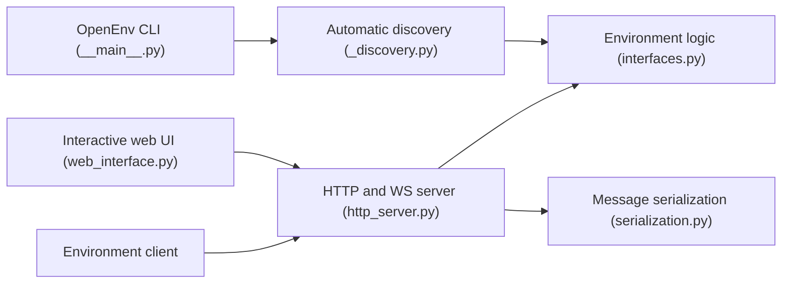

# meta-pytorch/OpenEnv

> Cadre pour créer, déployer et utiliser des environnements isolés d'entraînement par renforcement d'agents.

## Le problème
Chaque framework d'RL agentique invente ses propres interfaces d'environnement, difficiles à isoler et à partager.

## Ce que ça fait vraiment
Interface de type Gymnasium (`reset()`, `step()`, `state()`) : un serveur FastAPI dans un conteneur Docker héberge l'environnement, un client (asynchrone par défaut, `.sync()` disponible) lui parle en WebSocket. La CLI `openenv` crée, construit, sert, valide, importe et pousse des environnements vers Hugging Face Spaces. Exemples : Echo, Coding, Chess, Atari, FinRL ; intégrations TRL, torchforge, Unsloth, SkyRL, ART, Oumi.

## Comment c'est branché


## Essayer
```bash
pip install openenv
pip install git+https://huggingface.co/spaces/openenv/echo_env
openenv init my_game_env
openenv push
```

## Coût et pièges
Gratuit ; Docker pour héberger les environnements localement. Le README avertit d'un stade expérimental : bogues et API susceptibles de changer.

## Ce que ce n'est pas
Pas un framework d'entraînement : il fournit les environnements, l'entraînement se fait ailleurs (TRL, torchforge…). Le provider Kubernetes est « planifié ».

## Alternatives
Aucune alternative nommée dans le README.

## Pour toi
À surveiller : standard prometteur si tu fais de l'RL pour LLM, mais instable à ce stade.

