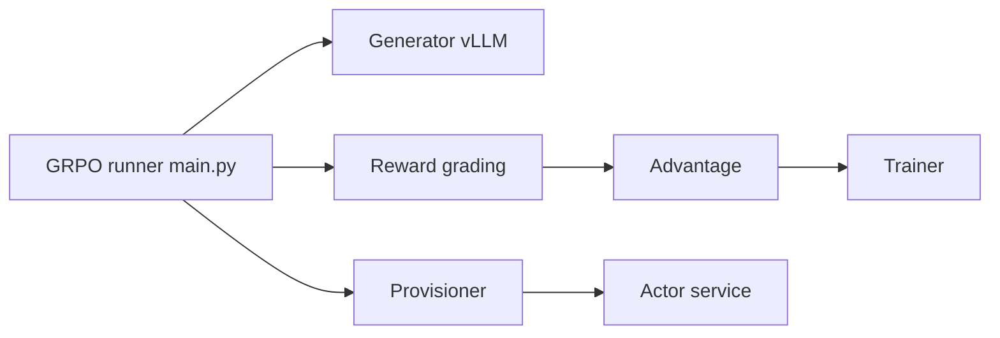

# meta-pytorch/torchforge

> Bibliothèque PyTorch d'apprentissage par renforcement agentique, séparant l'algorithme de l'infrastructure distribuée.

## Le problème
Expérimenter en RL sur LLM oblige à mélanger algorithme, placement GPU, tolérance aux pannes et communication.

## Ce que ça fait vraiment
Fournit des abstractions RL (récompenses, avantages, collation, pertes) et des acteurs/services distribués (provisioner, routeur, réplicas), avec vLLM pour la génération et torchtitan pour l'entraînement. Deux entrées : GRPO (`apps/grpo`) et SFT (`apps/sft`). Le README signale que le développement est en pause, l'entraînement LLM de PyTorch étant consolidé dans torchtitan.

## Comment c'est branché


## Essayer
```bash
conda create -n forge python=3.12
conda activate forge
./scripts/install.sh
python -m apps.grpo.main --config apps/grpo/qwen3_1_7b.yaml
python -m apps.sft.main --config apps/sft/llama3_8b.yaml
```

## Coût et pièges
Minimum 2 GPU pour le GRPO ; dépend de PyTorch 2.9.0, Monarch, vLLM, torchtitan. Installation par script DNF/conda ; uv non fonctionnel.

## Ce que ce n'est pas
Plus un projet actif : développement en pause. Pas un outil prêt pour un laptop.

## Alternatives
- torchtitan : cité comme destination de la consolidation.

## Pour toi
À ignorer pour un nouveau projet : développement en pause, mieux vaut suivre torchtitan ; lecture utile seulement pour les abstractions RL.

