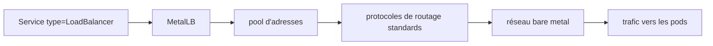

# metallb/metallb

> Implémentation de load balancer pour clusters Kubernetes bare metal, via protocoles de routage standards.

## Le problème
Sur du bare metal, un Service de type LoadBalancer reste en attente indéfiniment : aucun cloud provider ne vient lui attribuer d'IP.

## Ce que ça fait vraiment
Fournit une implémentation de load balancer pour les clusters Kubernetes bare metal.
S'appuie sur des protocoles de routage standards plutôt que sur une API cloud.
Le reste des fonctionnalités n'est pas décrit dans le README, qui renvoie au site du projet.

## Comment c'est branché

## Essayer
Aucune commande d'installation n'est documentée dans le README : il renvoie au site metallb.io et aux branches stables.

## Coût et pièges
Gratuit. Le README avertit explicitement que la branche `main` est la branche de développement : consommer ses manifests peut donner des déploiements instables ou non rétrocompatibles. Il faut se caler sur une branche stable.

## Ce que ce n'est pas
Pas un ingress controller : il attribue des IP externes aux Services, il ne route pas le HTTP. Pas un projet documenté dans son dépôt : le README tient en trois sections, dont un avertissement et une procédure de divulgation de vulnérabilités. Pas utilisable en cloud managé, où le provider fait déjà le travail.

## Alternatives
Aucune alternative nommée dans le README.

## Pour toi
Brique nécessaire si tu exposes des services depuis un cluster on-premise, par exemple un serveur d'inférence.
