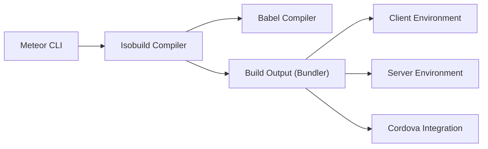

# meteor/meteor

> Plateforme JavaScript full-stack pour construire des applications web et mobiles avec un seul code, pour développeurs web.

## Le problème
Assembler client, serveur, compilation, temps réel et mobile demande de configurer de nombreux outils disparates.

## Ce que ça fait vraiment
Meteor fournit un outil en ligne de commande qui compile et empaquette une appli (compilateur Isobuild, Babel) pour un environnement client, un serveur Node et, via Cordova, des applications mobiles. Un système de paquets (Atmosphere, npm) l'étend. Il s'associe à React, Blaze, Vue, Svelte ou Solid. Le README mentionne des « Meteor Agent Skills » pour assistants de code.

## Comment c'est branché


## Essayer
```bash
npx meteor
meteor create
cd my-app
meteor
```

## Coût et pièges
Gratuit ; Galaxy, l'hébergement cité, est un service à part. La licence est présente mais non identifiée par GitHub : à vérifier avant tout usage commercial.

## Ce que ce n'est pas
Pas un outil data ni IA, et pas un simple bibliothèque : il impose sa chaîne de build et ses conventions.

## Alternatives
- Aucune alternative nommée dans le README (React, Vue, Svelte, Solid y figurent comme couches d'interface, pas comme concurrents).

## Pour toi
Ignorer : un framework d'applications web full-stack ne sert pas un flux data/IA/MLOps, et sa licence non identifiée est un défaut de plus.

