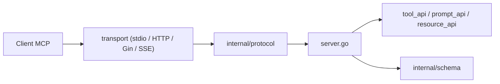

# metoro-io/mcp-golang

> Bibliothèque Go non officielle pour écrire des serveurs et clients MCP avec des structs typées.

## Le problème
Écrire un serveur MCP en Go demande du code de protocole, du schéma JSON et de la sérialisation à la main.

## Ce que ça fait vraiment
Les arguments d'outils sont des structs Go annotées `jsonschema` ; la bibliothèque génère le schéma, désérialise et gère les erreurs. Elle expose tools, prompts et ressources (avec notifications et pagination), un client, et des transports stdio, HTTP, Gin, SSE ou personnalisés. HTTP/Gin sont sans état : pas de notifications.

## Comment c'est branché


## Essayer
```bash
go get github.com/metoro-io/mcp-golang
```
Le README fournit ensuite un exemple Go (`NewServer`, `RegisterTool`, `Serve`) et la config Claude Desktop (`claude_desktop_config.json`).

## Coût et pièges
Gratuit. Le transport HTTP n'est pas bidirectionnel ; l'authentification HTTPS personnalisée est marquée « en cours ». Projet non officiel : suit la spec MCP à son rythme.

## Ce que ce n'est pas
Pas le SDK officiel du protocole. Pas un framework d'agents : uniquement la couche serveur/client MCP.

## Alternatives
Le README ne cite aucune alternative.

## Pour toi
À surveiller : utile seulement si tu exposes des outils MCP depuis du Go ; en Python ou TypeScript, les SDK habituels sont plus naturels.
