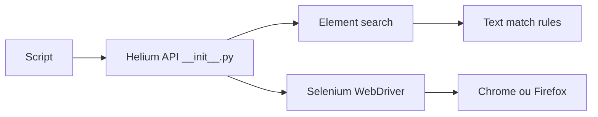

# mherrmann/helium

> Surcouche Python de Selenium pour automatiser Chrome et Firefox avec des libellés visibles.

## Le problème
Selenium impose des IDs, XPath et CSS fragiles, des attentes manuelles et du changement de frame.

## Ce que ça fait vraiment
Ajoute une API de haut niveau : on désigne les éléments par leur texte (`Button('Download')`). Gère les iframes imbriquées sans « switch », les fenêtres popup, l'attente implicite de 10 s et `wait_until`. On peut mélanger Helium et Selenium sur le même driver.

## Comment c'est branché


## Essayer
```bash
python -m pip install helium
```
```python
driver = start_chrome()
wait_until(Button('Download').exists)
```

## Coût et pièges
Gratuit ; Chrome ou Firefox requis. L'auteur répond rarement aux issues et ne maintient pas gratuitement, mais accepte les PR.

## Ce que ce n'est pas
Pas un nouveau moteur : tout passe par Selenium. Internet Explorer et Java ne sont plus pris en charge.

## Alternatives
Aucune alternative nommée dans le README (Selenium brut comparé).

## Pour toi
À surveiller : pratique pour du scraping ou des tests rapides, mais un mainteneur à temps très partiel est un risque sur la durée.

