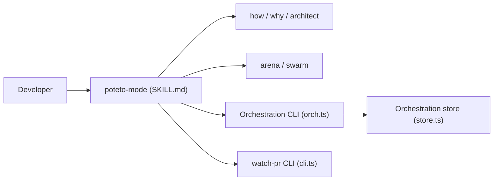

# michael-denyer/pstack-claude

> Pile de skills d'agents de code (issue de pstack de Lauren Tan), portée vers Claude Code, Codex, Pi et Copilot.

## Le problème
Les agents de code livrent des résultats inégaux sans méthode : diagnostic, planification, vérification.

## Ce que ça fait vraiment
- `poteto-mode` reçoit un objectif et choisit un playbook parmi planification, fonctionnalité, refactoring, performance, enquête, PR.
- Skills ciblés : how, why, architect, arena, swarm, interrogate, unslop, vérification.
- Hook de routage au démarrage de session ; `setup-pstack` règle modèles et niveaux de raisonnement.
- CLI `watch-pr` et état d'orchestration durable.
- Pas de serveur ni de télémétrie ; les contenus lus vont au fournisseur de modèle.

## Comment c'est branché


## Essayer
```bash
/plugin marketplace add michael-denyer/pstack-claude
/plugin install pstack@pstack-claude
```
Puis : « Use poteto-mode to fix the search filter resetting when I change pages. »

## Coût et pièges
Gratuit, mais les agents consomment des jetons de ton fournisseur ; les workflows multi-agents peuvent coûter cher. Copilot : tests annoncés sur CLI 1.0.87 à 1.0.92.

## Ce que ce n'est pas
Pas un agent autonome : des instructions et scripts pour agents existants.

## Alternatives
Le README mentionne le plugin séparé agent-formal-verify pour TLA+ et Lean.

## Pour toi
À surveiller : intéressant si tu codes beaucoup avec des agents ; projet récent à une personne, à essayer sur un dépôt secondaire.

