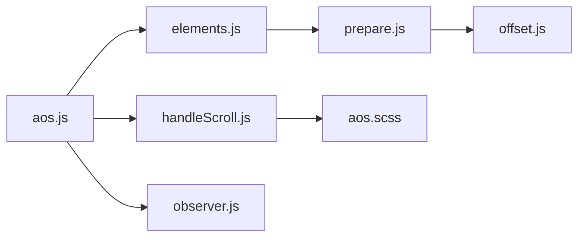

# michalsnik/aos

> Bibliothèque qui déclenche des animations CSS au défilement de la page, pour intégrateurs web.

## Le problème
Animer des éléments à leur apparition au scroll sans écrire du JavaScript pour chacun.

## Ce que ça fait vraiment
Tu ajoutes un attribut `data-aos` à un élément ; AOS calcule sa position, puis applique une classe d'animation au défilement et émet des événements `aos:in` et `aos:out`. Réglages par attribut `data-aos-*` (délai, durée, easing, ancre) ; mutations du DOM détectées. Ce README concerne la branche aos@next ; la v2 est ailleurs.

## Comment c'est branché


## Essayer
```bash
npm install --save aos@next
```
```js
import AOS from 'aos';
import 'aos/dist/aos.css';
AOS.init();
```

## Coût et pièges
Gratuit. Durée et délai limités à 50–3000 ms par pas de 50. Sans MutationObserver (IE), appeler `AOS.refreshHard()` à la main.

## Ce que ce n'est pas
Pas un moteur d'animation complet : il déclenche des transitions CSS. Dernier push en mars 2024, et la branche documentée est « next ».

## Alternatives
Aucune alternative nommée dans le README.

## Pour toi
Surveiller : sans intérêt pour un travail data/IA, sauf pour habiller une page de démo ; peu actif.

