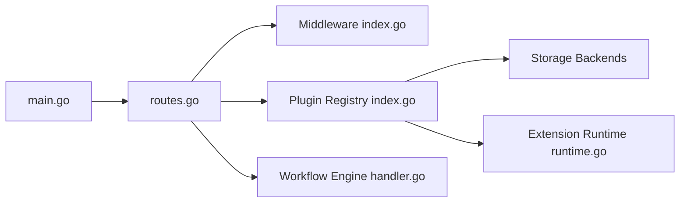

# mickael-kerjean/filestash

> Gestionnaire de fichiers web à plugins, parlant FTP, SFTP, S3, SMB, WebDAV et une vingtaine d'autres stockages.

## Le problème
Accéder à des stockages hétérogènes via une seule interface, et les exposer sous d'autres protocoles.

## Ce que ça fait vraiment
Serveur Go avec un client web en JS natif. Tout passe par des plugins : stockage (`IBackend`), authentification, autorisation, recherche, éditeurs de fichiers. Des plugins runtime en zip peuvent embarquer du wasm avec permissions réseau limitées. Moteur de workflow, liens partagés, passerelles (S3, SFTP, MCP, AS2), recherche SQLite en texte intégral.

## Comment c'est branché

## Essayer
Le README ne documente aucune commande d'installation : il renvoie au guide « Getting started » du site.

## Coût et pièges
Gratuit en auto-hébergement. AGPL-3.0 : obligations de publication si tu l'offres en service modifié. Les clients natifs et passerelles sont des produits distincts.

## Ce que ce n'est pas
Pas un simple Dropbox : un cadre à plugins. Les fonctions « IA » (recherche, OCR) ne sont décrites qu'en une ligne.

## Alternatives
Aucune alternative nommée dans le README.

## Pour toi
À surveiller : intéressant pour fédérer des stockages (parquet, hdf5, netcdf lisibles via apps), mais il faut maîtriser l'AGPL et la sécurité d'un accès multi-stockage.

