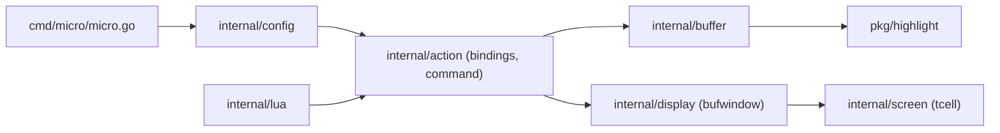

# micro-editor/micro

> Éditeur de texte en terminal, simple et intuitif, livré en binaire statique unique.

## Le problème
Éditer un fichier par SSH oblige à choisir entre nano, sommaire, et vim, difficile à prendre en main.

## Ce que ça fait vraiment
Éditeur en terminal : curseurs multiples, onglets et découpages, souris, coloration pour plus de 130 langages, annulation persistante, macros et plugins Lua avec gestionnaire intégré. D'après le code : entrée cmd/micro/micro.go, configuration et ressources embarquées (runtime/), tampon de texte internal/buffer, actions et raccourcis internal/action, rendu tcell via internal/display et screen. Des tâches shell et un terminal intégré passent par internal/shell.

## Comment c'est branché


## Essayer
```bash
brew install micro
snap install micro --classic
eget micro-editor/micro
micro path/to/file.txt
ip a | micro
```

## Coût et pièges
Gratuit. Le script curl | bash est tiers. Le presse-papier système demande xclip, xsel ou wl-clipboard. Cygwin, Mingw et Plan9 ne sont pas pris en charge.

## Ce que ce n'est pas
Pas un IDE. Ce dépôt est le même projet que zyedidia/micro (README identique, statistiques légèrement différentes) : doublon du catalogue à fusionner.

## Alternatives
- nano : dont micro se veut le successeur.

## Pour toi
À adopter : éditeur sans dépendance pour toucher à des fichiers de configuration sur serveurs et conteneurs distants.

