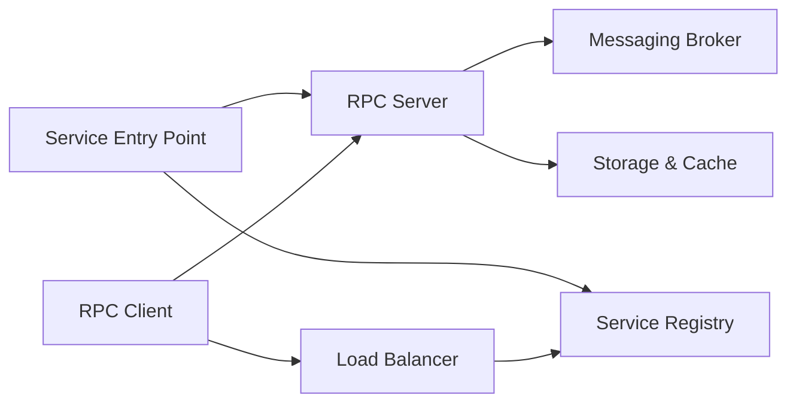

# micro/go-micro

> Framework Go de microservices repositionné en « harness » d'agents LLM exposés via MCP et A2A.

## Le problème
Brancher un agent sur de vrais outils demande découverte de services, mémoire, garde-fous et protocoles d'interop, souvent recollés à la main autour d'une boucle LLM.

## Ce que ça fait vraiment
Un service est une struct Go ; ses méthodes deviennent des endpoints REST/gRPC et des outils MCP (doc comments → descriptions).
`micro.NewAgent` crée un service avec un LLM : mémoire persistée (Postgres, NATS KV, fichier), outils `plan` et `delegate`, garde-fous `MaxSteps`, `LoopLimit`, `ApproveTool`.
`micro run --prompt` génère des services Go depuis une description ; flows durables, registre mDNS/Consul/etcd, broker NATS/RabbitMQ.
Neuf fournisseurs LLM, dont Ollama en local.

## Comment c'est branché


## Essayer
```bash
curl -fsSL https://go-micro.dev/install.sh | sh
go install go-micro.dev/v6/cmd/micro@latest
micro new helloworld
cd helloworld
micro run
```

## Coût et pièges
Gratuit ; sans clé, le chemin « no-secret » fonctionne avec un modèle mock. La génération par prompt consomme ta clé LLM. Support commercial proposé.

## Ce que ce n'est pas
Pas un framework Python : tout est en Go. L'architecture fournie décrit le framework microservices historique, pas la couche agent : le schéma ci-dessus ne montre pas cette partie. Paiements x402 optionnels, sans crypto intégrée.

## Alternatives
Aucune alternative nommée dans le README.

## Pour toi
À surveiller : idée intéressante (tout outil est un service), mais tu travailles en Python, et le virage agent est récent par rapport à la base microservices.
