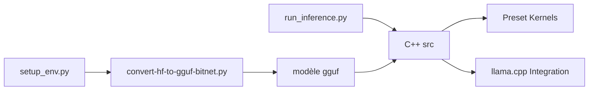

# microsoft/BitNet

> Moteur d'inférence C++ pour LLM et embeddings 1-bit sur CPU, pour inférence locale.

## Le problème
Faire tourner un LLM sur CPU est lent et énergivore en pleine précision.

## Ce que ça fait vraiment
bitnet.cpp, bâti sur llama.cpp, fournit des noyaux optimisés (I2_S, TL1, TL2) pour modèles ternaires b1.58, CPU et GPU. `setup_env.py` télécharge et convertit un modèle Hugging Face en GGUF, `run_inference.py` le lance. Modèles officiels : BitNet-b1.58-2B-4T, embeddings 0.6B et 270M. Accélérations annoncées de 1,37× à 6,17× selon CPU.

## Comment c'est branché


## Essayer
```bash
git clone --recursive https://github.com/microsoft/BitNet.git
pip install -r requirements.txt
huggingface-cli download microsoft/BitNet-b1.58-2B-4T-gguf --local-dir models/BitNet-b1.58-2B-4T
python setup_env.py -md models/BitNet-b1.58-2B-4T -q i2_s
python run_inference.py -m models/BitNet-b1.58-2B-4T/ggml-model-i2_s.gguf -p "You are a helpful assistant" -cnv
```

## Coût et pièges
Compilation clang ≥ 18 et cmake ; sous Windows, Visual Studio 2022. Ne marche qu'avec des modèles entraînés en 1-bit, pas avec n'importe quel LLM quantifié.

## Ce que ce n'est pas
Pas un remplaçant général de llama.cpp ; catalogue de modèles compatibles restreint.

## Alternatives
Aucune nommée comme alternative (llama.cpp est la base).

## Pour toi
Embeddings 1-bit sur CPU intéressants pour du RAG léger : à surveiller.
