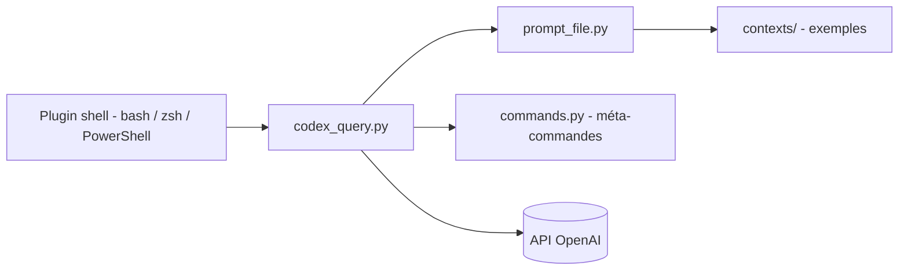

# microsoft/Codex-CLI

> Démonstration Microsoft de 2022 qui traduit des phrases en commandes shell via GPT-3 Codex.

## Le problème
Écrire une commande shell exacte exige de connaître la syntaxe de PowerShell, Bash ou zsh.

## Ce que ça fait vraiment
On écrit un commentaire en langage naturel dans le shell puis `Ctrl + G` : un plugin envoie la ligne au module Python `codex_query.py`, qui construit une invite avec des exemples (fichiers du dossier `contexts/`) et interroge l'API OpenAI. La commande revient dans le terminal. Un mode multi-tours garde l'historique dans `current_context.txt`. Des méta-commandes gèrent contextes et configuration.

## Comment c'est branché

## Essayer
Le README renvoie aux instructions d'installation par shell, hors README. Usage : écrire un commentaire commençant par `#` puis `Ctrl + G`. Réglages : `# set engine cushman-codex`, `# set temperature 0.5`, `# set max_tokens 50`.

## Coût et pièges
Compte OpenAI, clé d'API, identifiant d'organisation et d'engine à fournir ; chaque requête est facturée. Les moteurs Codex de l'époque (`code-davinci-002`) peuvent ne plus être disponibles. Dernier push en janvier 2024.

## Ce que ce n'est pas
Le dépôt se présente comme un exemple pour la conférence Build 2022, pas comme un produit. Les commandes générées peuvent être fausses : ne rien exécuter sans comprendre.

## Alternatives
`zsh_codex` (cité comme source d'inspiration), limité à zsh.

## Pour toi
À ignorer : démonstration ancienne dépendant de modèles retirés ou payants ; l'idée se retrouve ailleurs, mais pas ce code.

