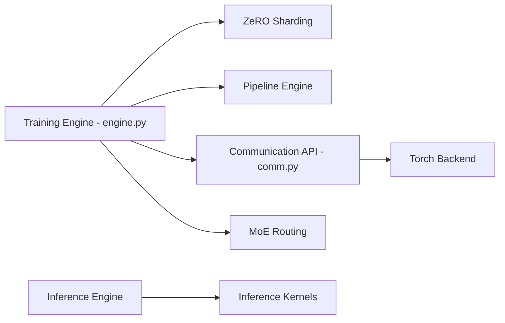

# microsoft/DeepSpeed

> Bibliothèque d'entraînement et d'inférence distribués pour très grands modèles PyTorch, pour ingénieurs ML.

## Le problème
Entraîner un modèle de plusieurs milliards de paramètres dépasse la mémoire d'un GPU et la bande passante réseau.

## Ce que ça fait vraiment
Optimisations système : ZeRO et ZeRO-Infinity (partition de l'état d'optimiseur, offload CPU/NVMe), parallélisme 3D, Ulysses (séquences longues), MoE, compression/quantification, moteurs d'inférence. Intégré à Accelerate, Lightning, MosaicML, Determined. Les extensions C++/CUDA sont compilées à la volée (JIT, ninja).

## Comment c'est branché


## Essayer
```bash
pip install deepspeed
ds_report
```

## Coût et pièges
PyTorch doit être installé avant. Un compilateur CUDA/ROCm (nvcc ou hipcc) est nécessaire pour les extensions. Windows : certaines fonctions (AIO, GDS) absentes.

## Ce que ce n'est pas
Pas utile sur un seul petit GPU ni pour du fine-tuning léger. Ce n'est pas un framework d'entraînement complet : il se branche sur le vôtre.

## Alternatives
Aucune alternative nommée dans le README.

## Pour toi
À adopter dès que l'entraînement de gros modèles ou l'offload mémoire entre en jeu ; inutile pour des modèles qui tiennent sur une carte.

