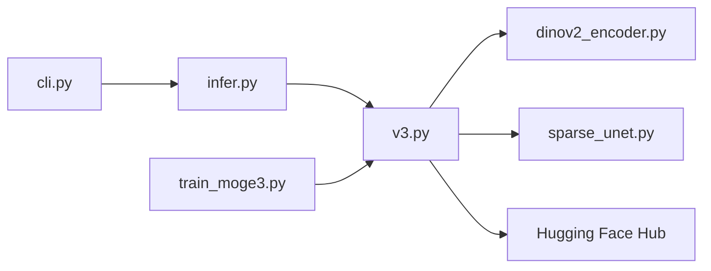

# microsoft/MoGe

> Modèle qui estime la géométrie 3D (profondeur, normales, nuage de points, FOV) à partir d'une seule image.

## Le problème
Reconstruire une scène 3D métrique depuis une photo unique demande normalement plusieurs vues ou du matériel dédié.

## Ce que ça fait vraiment
À partir d'une image, un seul passage avant renvoie carte de points, profondeur, normales, masque et intrinsèques de caméra. Trois générations (v1, v2, v3) avec des poids sur Hugging Face, de 35M à 1,25B de paramètres. Une CLI `moge infer` exporte cartes, `.glb` et `.ply` ; une démo Gradio et un mode panorama expérimental existent. Latence annoncée : 60 ms par image (A100/RTX3090, FP16, ViT-L).

## Comment c'est branché


## Essayer
```bash
git clone https://github.com/microsoft/MoGe.git
cd MoGe
uv sync
moge infer -i IMAGES_FOLDER_OR_IMAGE_PATH --version v2 --o OUTPUT_FOLDER --maps --glb --ply
moge app --version v2
```

## Coût et pièges
GPU CUDA (wheels CUDA 13.0 par défaut). macOS non supporté pour MoGe-3 (Triton). v3 exige un checkpoint passé via `--pretrained`.

## Ce que ce n'est pas
Pas un outil de reconstruction multi-vues. La licence n'est pas identifiée par GitHub : à lire avant tout usage commercial.

## Alternatives
Aucune alternative nommée dans le README.

## Pour toi
À surveiller : utile si tu fais de la vision 3D ou de la robotique, mais vérifie d'abord le fichier de licence avant de l'embarquer.

