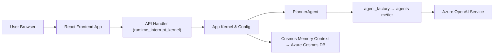

# microsoft/Multi-Agent-Custom-Automation-Engine-Solution-Accelerator

> Accélérateur Azure qui orchestre plusieurs agents IA spécialisés pour automatiser des tâches métier ; pour équipes Azure.

## Le problème
Coordonner des tâches entre départements (RH, achats, marketing, support) mobilise des équipes et produit des erreurs de coordination manuelle.

## Ce que ça fait vraiment
Une interface React envoie une tâche à un backend Python (Semantic Kernel). Un agent planificateur la découpe, des agents par domaine (HR, Marketing, Procurement, Product, TechSupport, Human) l'exécutent via des outils, et la mémoire est persistée dans Cosmos DB. Le déploiement Azure est décrit en Bicep, avec Container Apps et Azure OpenAI.

## Comment c'est branché


## Essayer
Aucune commande de déploiement dans le README, qui renvoie au guide de déploiement (azd 1.18.0+, Bicep 0.33.0+ en local). Seule commande documentée, pour tout arrêter :
```bash
azd down
```

## Coût et pièges
Abonnement Azure requis, avec quota Azure OpenAI ; coûts à l'usage, sauf Container Registry facturé au registre et par jour. Pensez à supprimer le groupe de ressources après essai.

## Ce que ce n'est pas
Pas un produit fini : le README le qualifie de preuve de concept, sortie non fiable, anglais uniquement, sans garantie de Microsoft. Ce n'est pas un framework agnostique du cloud.

## Alternatives
Aucune alternative citée ; le README renvoie seulement à d'autres accélérateurs Microsoft (Document Knowledge Mining, Conversation Knowledge Mining).

## Pour toi
À surveiller comme modèle d'architecture planificateur / exécuteur sur Azure, pas à déployer tel quel : preuve de concept liée à Azure et facturée à l'usage.
