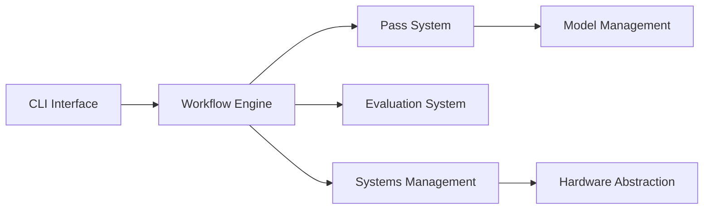

# microsoft/Olive

> Boîte à outils qui optimise un modèle pour ONNX Runtime selon le matériel cible et les contraintes.

## Le problème
Optimiser un modèle (quantification, graphe ONNX) pour un matériel donné oblige à enchaîner à la main plusieurs outils et à mesurer précision et latence.

## Ce que ça fait vraiment
Olive compose des techniques d'optimisation (« passes ») et produit un modèle ONNX pour le cloud ou l'edge. La commande `olive optimize` récupère le modèle Hugging Face, le quantifie en int4 par GPTQ, capture le graphe ONNX puis l'optimise. Un moteur de workflow, un cache et un évaluateur pilotent l'ensemble. Des intégrations existent avec Hugging Face, Azure AI et MLflow.

## Comment c'est branché


## Essayer
```bash
pip install olive-ai
pip install transformers onnxruntime-genai
olive optimize \
    --model_name_or_path Qwen/Qwen2.5-0.5B-Instruct \
    --precision int4 \
    --output_path models/qwen
```

## Coût et pièges
Gratuit. Télécharge le modèle depuis Hugging Face ; sous Windows, avertissement sur les liens symboliques du cache (`HF_HUB_DISABLE_SYMLINKS_WARNING`). Le README indique que les distributions peuvent envoyer des données d'usage à Microsoft.

## Ce que ce n'est pas
Ce n'est pas un moteur d'inférence : il produit des modèles pour ONNX Runtime, qui les exécute. Les architectures hors liste demandent de fournir `io_config`.

## Alternatives
- Aucune alternative nommée dans le README.

## Pour toi
Adopter si tu déploies des modèles via ONNX Runtime : une commande enchaîne quantification et optimisation, mais garde en tête la télémétrie possible.
