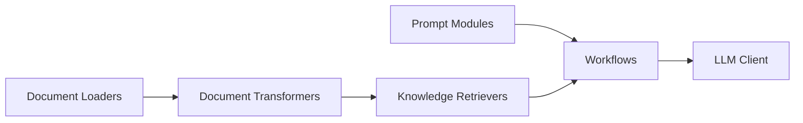

# microsoft/PIKE-RAG

> Cadre de RAG par extraction de connaissances métier et raisonnement, pour questions multi-sauts complexes.

## Le problème
La recherche par embeddings seule échoue sur les corpus professionnels : découpage qui casse le sens, jargon et alias mal alignés, raisonnement en plusieurs étapes.

## Ce que ça fait vraiment
Modules d'analyse de documents, d'extraction, de stockage, de récupération (BM25, Chroma), d'organisation et de raisonnement, pilotés par des workflows YAML. Le README annonce 87,6 % sur HotpotQA, 82,0 % sur 2WikiMultiHopQA et 59,6 % sur MuSiQue. Clients LLM Azure et Hugging Face. Dépôt archivé.

## Comment c'est branché

## Essayer
Le README ne donne que des étapes : cloner, créer l'environnement Python, remplir un `.env` avec les points d'accès, modifier les configs YAML et lancer les scripts de `examples/`. Aucune commande exacte n'est fournie.

## Coût et pièges
Points d'accès LLM à ta charge (Azure surtout). Archivé, dernier push en septembre 2025 : plus de correctifs attendus. Les scores sont ceux de l'auteur.

## Ce que ce n'est pas
Pas une bibliothèque maintenue ni un produit : un artefact de recherche à lire ou adapter.

## Alternatives
Aucune alternative nommée dans le README.

## Pour toi
À ignorer comme dépendance : archivé et sans mises à jour ; à lire pour ses idées (réécriture duale, décomposition), pas à installer.
