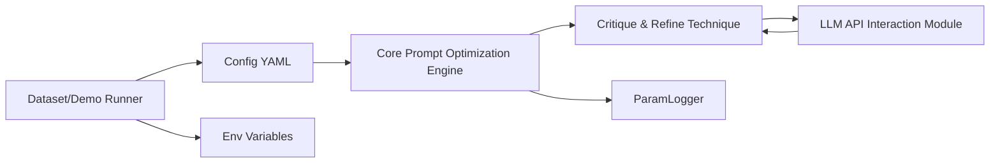

# microsoft/PromptWizard

> Cadre d'optimisation de prompts où le LLM génère, critique et affine ses propres instructions et exemples.

## Le problème
Écrire à la main un bon prompt, avec ses exemples en contexte, demande de nombreux essais sans méthode reproductible.

## Ce que ça fait vraiment
À partir d'une description de tâche et d'une instruction de base, l'outil fait muter l'instruction par le LLM, la note sur des lots de questions, la critique et l'affine sur plusieurs itérations. Il optimise aussi les exemples en contexte (positifs, négatifs, synthétiques) et génère des raisonnements pas à pas. Trois scénarios : sans exemples, avec exemples synthétiques, avec données d'entraînement. Les réglages sont dans `promptopt_config.yaml`, les clés dans un fichier `.env`.

## Comment c'est branché


## Essayer
```bash
git clone https://github.com/microsoft/PromptWizard
cd PromptWizard
python -m venv venv
source venv/bin/activate
pip install -e .
```
Les scénarios se lancent ensuite via le notebook `demo.ipynb`.

## Coût et pièges
Chaque itération appelle le LLM : clé OpenAI ou point d'accès Azure OpenAI à ta charge. Le README annonce 20 à 30 minutes d'optimisation en moyenne sur GSM8k, SVAMP, AQUARAT et BBII. Les prompts obtenus sont très détaillés : à relire et à raccourcir à la main.

## Ce que ce n'est pas
Ce n'est pas une bibliothèque générique clés en main : chaque jeu de données demande sa classe de traitement (`extract_final_answer`, `access_answer`) et son format de réponse. Les courbes de performance du README sont celles des auteurs.

## Alternatives
Aucune alternative nommée dans le README.

## Pour toi
À surveiller : utile pour tester l'optimisation automatique de prompts sur une tâche à réponse vérifiable, mais le code est de recherche (dernier push en octobre 2025) et son coût en appels n'est pas chiffré.
