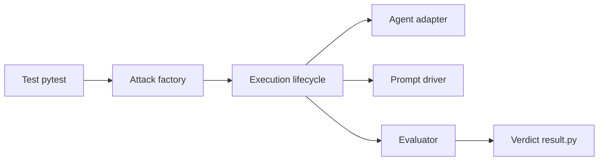

# microsoft/RAMPART

> Cadre de tests pytest pour la sécurité et la sûreté d'applications IA agentiques.

## Le problème
Tester les attaques et défaillances d'agents IA se fait sans méthode structurée ni intégration aux tests habituels.

## Ce que ça fait vraiment
Fiche minimale : le README décrit seulement un cadre pytest couvrant attaques adversariales, échecs bénins et catégories de dommages, avec assertions pilotées par évaluation. D'après l'architecture : stratégies d'attaque (XPIA, mono-tour), adaptateur d'agent, pilotes de prompts (statique, LLM, pont PyRIT), évaluateurs dont un juge LLM, générateur de charges utiles.

## Comment c'est branché

## Essayer
Aucune commande documentée dans le README.

## Coût et pièges
Non documenté. Le juge LLM implique probablement des appels de modèle à ta charge (non confirmé par le README).

## Ce que ce n'est pas
Pas documenté : installation, usage et limites sont absents du README.

## Alternatives
Aucune alternative citée dans le README (PyRIT apparaît seulement dans l'architecture).

## Pour toi
À surveiller : sujet utile (red teaming d'agents, éditeur crédible) mais impossible à évaluer sans documentation.

