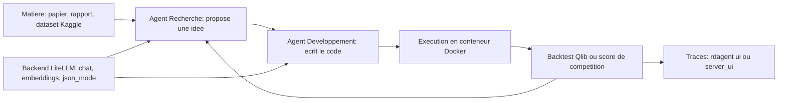

# microsoft/RD-Agent

> **An LLM agent that proposes and codes data R&D ideas by itself, mostly quant finance and Kaggle.**

## The problem

Without it, every turn of data R&D is manual: read a paper or a financial report, pull out a
factor or a model architecture, implement it, backtest it, start again. The README frames the
loop as two halves, "R" for proposing ideas and "D" for implementing them, and today a human
pays for every turn.

## What it actually does

RD-Agent runs autonomous propose-implement-execute-feedback loops over the scenarios shipped
with the package. Its commands spell out the list: `fin_quant`, `fin_factor`, `fin_model` for
Qlib factors and models, `fin_factor_report` to extract factors from financial reports,
`general_model` to implement a model from an arXiv URL, `data_science --competition` for
Kaggle and local competitions, and `llm_finetune` (FT-Agent) for benchmark-driven LLM
fine-tuning. Generated code runs inside Docker. Two viewers exist: `rdagent ui` (Streamlit,
the only one covering `data_science`) and `rdagent server_ui` (Flask backend plus a `web/`
frontend built with npm). The README claims the top spot on MLE-bench at 30.22% across the
75 competitions with o3 + GPT-4.1, and for RD-Agent(Q) roughly 2x the ARR of benchmark factor
libraries for under $10 of LLM spend.

## How it is wired



The README describes a two-role loop fed by a single LLM backend. LiteLLM is the default,
configured through a `.env` file that requires a `CHAT_MODEL`, an `EMBEDDING_MODEL` and the
matching keys (OpenAI, Azure OpenAI, or DeepSeek plus SiliconFlow for embeddings). Generated
code executes in Docker, evaluation comes from the chosen scenario (Qlib for finance, the
competition itself for `data_science`), and traces are read back in either UI. These flows
come from the README; no code-derived diagram exists for this repository.

## Trying it

```sh
conda create -n rdagent python=3.10
conda activate rdagent
pip install rdagent
rdagent health_check --no-check-env
# then fill in .env (CHAT_MODEL, EMBEDDING_MODEL, keys) and check:
rdagent health_check
rdagent fin_factor
rdagent ui --port 19899 --log-dir <your log folder like "log/"> --data-science
```

## Cost and traps

Linux only, stated at the top of the quick start. Docker must be installed and usable without
`sudo`. The LLM bill is yours: chat plus embeddings, for as many turns as the loop runs — the
README only quantifies RD-Agent(Q), "under $10", and says nothing about the other scenarios.
DeepSeek has no embedding model, so a second provider is needed. Kaggle requires an account,
an API token and accepting each competition's rules. Port 19899 must be free. On the Web UI:
the Flask backend binds to `127.0.0.1` and refuses any other address unless
`UI_SERVER_AUTH_TOKEN` is set, and legacy pickle trace loading is off by default because
pickle deserialization can execute code.

## What it is not

Not a library you import into your own pipeline: it is a scenario CLI, and stepping outside
the shipped list is not documented in the README. Not a trading tool: the legal disclaimer
states it is not ready-to-use for financial investment or advice and does not reflect
Microsoft's opinions. The MLE-bench scores come from specific models (o3, GPT-4.1,
o1-preview); a cheaper backend will not reproduce them, and the README does not say what it
will produce. And the Web UI does not yet cover the `data_science` scenario.

## Alternatives

- AIDE, named in the README as the previous best public MLE-bench result: simpler to run, but
  without the finance scenarios or the joint factor-model loop.
- ruc-datalab/DeepAnalyze (catalogue neighbour) if the need is agent-driven data analysis
  without RD-Agent's Qlib and Docker machinery.
- e2b-dev/E2B (catalogue neighbour) if all you want is isolated execution of generated code,
  without the idea-proposal layer.

## For you

One of the few data R&D agents backed by an industrial lab, with published and reproducible
results — worth watching to see how far the modelling loop can be automated. But Linux plus
Docker plus an open-ended LLM bill, and a CLI locked to its scenarios: watch it and try it on
a toy case, do not put it in production.
