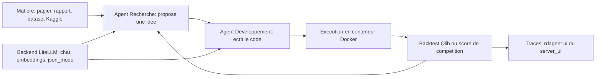

# microsoft/RD-Agent

> **Agent LLM qui propose et code lui-même des idées de R&D data, surtout finance quantitative et Kaggle.**

## Le problème

Sans cet outil, chaque itération de R&D data — lire un papier ou un rapport, en extraire un
facteur ou une architecture, l'implémenter, le backtester, recommencer — se fait à la main.
Le README pose le cadre : « R » proposer des idées, « D » les implémenter, et le coût de la
boucle est humain à chaque tour.

## Ce que ça fait vraiment

RD-Agent exécute des boucles autonomes « proposition → implémentation → exécution → retour »
sur des scénarios livrés avec le paquet. Les commandes du README en montrent la liste :
`fin_quant`, `fin_factor`, `fin_model` (facteurs et modèles Qlib), `fin_factor_report`
(extraction de facteurs depuis des rapports financiers PDF), `general_model` (implémentation
d'un modèle depuis l'URL d'un papier arXiv), `data_science --competition` (Kaggle et
compétitions locales), `llm_finetune` (FT-Agent, fine-tuning de LLM piloté par benchmark).
Le code généré est exécuté dans Docker, et deux interfaces de suivi existent : `rdagent ui`
(Streamlit, seule à couvrir `data_science`) et `rdagent server_ui` (backend Flask plus
frontend `web/` à construire avec npm). Le README revendique la première place sur MLE-bench
(30,22 % sur les 75 compétitions, config o3 + GPT-4.1) et, pour RD-Agent(Q), un ARR environ
2× supérieur à des bibliothèques de facteurs de référence pour moins de 10 $ de dépense LLM.

## Comment c'est branché



Le README décrit une boucle en deux rôles, « R » et « D », alimentée par un backend LLM
unique : LiteLLM est le backend par défaut, configuré via un fichier `.env` qui exige un
`CHAT_MODEL`, un `EMBEDDING_MODEL` et les clés associées (OpenAI, Azure OpenAI, DeepSeek plus
SiliconFlow pour l'embedding). L'exécution du code produit passe par Docker, l'évaluation par
le scénario choisi (Qlib pour la finance, la compétition pour `data_science`), et les traces
se relisent dans l'une des deux UI. Ces flux sont ceux du README ; aucun diagramme tiré du
code n'est disponible pour ce dépôt.

## Essayer

```sh
conda create -n rdagent python=3.10
conda activate rdagent
pip install rdagent
rdagent health_check --no-check-env
# puis renseigner .env (CHAT_MODEL, EMBEDDING_MODEL, clés) et vérifier :
rdagent health_check
rdagent fin_factor
rdagent ui --port 19899 --log-dir <your log folder like "log/"> --data-science
```

## Coût et pièges

Linux uniquement, le README le dit en tête du démarrage rapide. Docker doit être installé et
utilisable sans `sudo`. La facture LLM est à ta charge : chat plus embeddings, sur autant de
tours que dure la boucle — le README chiffre seulement le cas RD-Agent(Q), « sous 10 $ », et
rien pour les autres scénarios. DeepSeek n'a pas de modèle d'embedding, il faut donc un second
fournisseur. Kaggle impose un compte, un token API et l'acceptation des règles de chaque
compétition. Le port 19899 des UI doit être libre. Côté Web UI : le backend Flask n'écoute que
sur `127.0.0.1` et refuse toute autre adresse sans `UI_SERVER_AUTH_TOKEN` ; le chargement des
traces pickle héritées est désactivé par défaut car la désérialisation peut exécuter du code.

## Ce que ce n'est pas

Ce n'est pas une bibliothèque qu'on importe dans son propre pipeline : c'est une CLI de
scénarios, et sortir de la liste livrée n'est pas documenté dans le README. Ce n'est pas un
outil de trading : le disclaimer légal précise que le projet n'est pas prêt à l'emploi pour
un investissement ou un conseil financier et n'engage pas Microsoft. Les scores MLE-bench
sont obtenus avec des modèles précis (o3, GPT-4.1, o1-preview) — un backend moins cher ne
donnera pas ces chiffres, et le README ne dit pas ce qu'il donne. Enfin la Web UI ne couvre
pas encore le scénario `data_science`.

## Alternatives

- AIDE, cité dans le README comme le meilleur résultat public antérieur sur MLE-bench : plus
  simple d'emploi, mais sans les scénarios finance ni la boucle facteur-modèle.
- ruc-datalab/DeepAnalyze (voisin du catalogue) si le besoin est l'analyse de données pilotée
  par agent sans l'appareillage Qlib et Docker de RD-Agent.
- e2b-dev/E2B (voisin du catalogue) si ce qu'on cherche n'est que l'exécution isolée de code
  généré, sans la couche de proposition d'idées.

## Pour toi

C'est l'un des rares agents de R&D data adossés à un labo industriel, avec des résultats
publiés et reproductibles — intéressant à suivre pour savoir jusqu'où va l'automatisation de
la boucle de modélisation. Mais Linux plus Docker plus facture LLM ouverte, et une CLI figée
sur ses scénarios : à surveiller et à tester sur un cas jouet, pas à poser en production.
