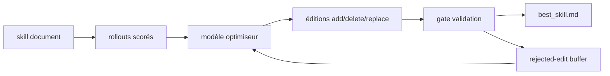

# microsoft/SkillOpt

> Entraîne un document de skill comme on entraîne des poids, sans toucher au modèle.

## Le problème
Les skills d'agent sont écrits à la main ou générés en un coup, et une auto-révision
non contrôlée n'améliore pas de façon fiable le point de départ.

## Ce que ça fait vraiment
Traite le document de skill comme l'état entraînable d'un agent gelé. Un modèle
optimiseur transforme des rollouts scorés en éditions bornées add/delete/replace ;
dans le chemin par défaut une édition n'est acceptée que si elle améliore
strictement un score de validation tenu à part. Budget de « learning rate »
textuel, buffer d'éditions rejetées, mise à jour lente/méta par epoch. L'artefact
déployé est un `best_skill.md` de 300–2000 tokens, sans appel modèle supplémentaire
à l'inférence.

## Comment c'est branché


## Essayer
```bash
pip install -e ".[webui]"
python -m skillopt_webui.app
```

## Coût et pièges
Le README ne donne pas la commande d'entraînement (renvoyée à `docs/`). Deux
modèles sont sollicités (cible + optimiseur) sur des rollouts répétés : la facture
d'API est celle d'une boucle d'optimisation, pas d'un appel. Le WebUI Gradio écoute
par défaut sur `0.0.0.0` — mettre `--host 127.0.0.1`.

## Ce que ce n'est pas
Pas du fine-tuning : aucun poids n'est modifié. Les chiffres annoncés (+23,5 points
sur GPT-5.5 en chat direct, 52 cellules) viennent des auteurs et de leur papier,
pas d'une reproduction indépendante. Aucune licence n'est déclarée dans le README.

## Alternatives
- Aucun dépôt alternatif nommé dans le README.

## Pour toi
Idée juste — versionner et scorer un prompt système comme un artefact. À surveiller,
pas à brancher tant que la licence n'est pas claire.
