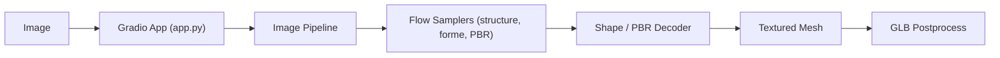

# microsoft/TRELLIS.2

> Modèle de 4 milliards de paramètres qui génère des assets 3D texturés à partir d'une image.

## Le problème
Produire des modèles 3D avec topologies complexes et matériaux PBR à partir d'une image est long et manuel.

## Ce que ça fait vraiment
Pipeline image→3D en trois étapes de flux (structure, forme, matériaux PBR) sur une représentation « O-Voxel ». Sort un maillage texturé et un GLB. Temps annoncés sur H100 : environ 3 s en 512³, 17 s en 1024³, 60 s en 1536³. Le dépôt inclut aussi l'entraînement et un démo web.

## Comment c'est branché


## Essayer
```bash
git clone -b main https://github.com/microsoft/TRELLIS.2.git --recursive
cd TRELLIS.2
. ./setup.sh --new-env --basic --flash-attn --nvdiffrast --nvdiffrec --cumesh --o-voxel --flexgemm
python app.py
```

## Coût et pièges
GPU NVIDIA d'au moins 24 Go (A100/H100 vérifiés), Linux uniquement, CUDA Toolkit compilé (12.4 recommandé). Installation longue.

## Ce que ce n'est pas
Pas un outil pour non-spécialistes : dépendances lourdes et testé seulement sous Linux. Le GLB sort en mode opaque, la transparence se règle à la main.

## Alternatives
Aucune alternative nommée dans le README.

## Pour toi
Surveiller : modèle 3D sérieux avec code d'entraînement, mais exige un GPU de 24 Go et une installation exigeante.

