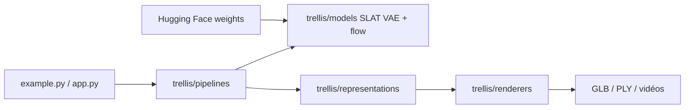

# microsoft/TRELLIS

> Modèle de génération d'objets 3D à partir de texte ou d'image, pour chercheurs et créateurs.

## Le problème
Produire des assets 3D texturés demande de la modélisation manuelle ou des méthodes limitées à un format de sortie.

## Ce que ça fait vraiment
Représentation latente structurée (SLAT) décodable en Gaussiennes 3D, champs de radiance ou maillages, avec transformeurs à flux rectifié. Modèles jusqu'à 2 milliards de paramètres, entraînés sur 500K objets, hébergés sur Hugging Face. Édition locale et variantes, export GLB et PLY, démo Gradio, code d'entraînement.

## Comment c'est branché


## Essayer
```bash
git clone --recurse-submodules https://github.com/microsoft/TRELLIS.git
cd TRELLIS
. ./setup.sh --new-env --basic --xformers --flash-attn --diffoctreerast --spconv --mipgaussian --kaolin --nvdiffrast
python app.py
```

## Coût et pièges
GPU NVIDIA d'au moins 16 Go, testé sur Linux (Windows non totalement testé), CUDA 11.8 ou 12.2. Installation longue avec compilation de sous-modules. Dernier push le 2026-06-26.

## Ce que ce n'est pas
Pas un service prêt à l'emploi ; le README recommande la version conditionnée par image plutôt que par texte.

## Alternatives
Aucune alternative citée dans le README.

## Pour toi
À surveiller : référence sérieuse pour la 3D générative sous MIT, mais réservée à qui dispose d'un GPU de 16 Go.

