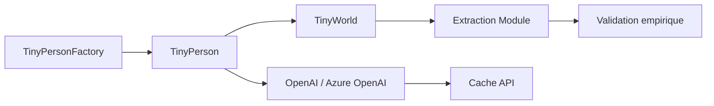

# microsoft/TinyTroupe

> Bibliothèque Python de simulation de personas LLM pour études de marché et tests.

## Le problème
Tester une pub, un produit ou un chatbot face à des profils d'utilisateurs variés coûte cher en panels réels.

## Ce que ça fait vraiment
`TinyPerson` : une persona définie en JSON ou en code, qui écoute et agit ; `TinyWorld` : un environnement où plusieurs personas interagissent.
`TinyPersonFactory` génère des populations à partir de données démographiques, en parallèle.
Extraction des résultats et validation empirique contre de vraies enquêtes (t-test, KS-test).
Cache des appels LLM et de l'état de simulation, suivi des coûts.

## Comment c'est branché


## Essayer
```bash
conda create -n tinytroupe python=3.10
conda activate tinytroupe
pip install git+https://github.com/microsoft/TinyTroupe.git@main
```

## Coût et pièges
Les coûts d'API peuvent être importants (gpt-5-mini par défaut) ; le cache est recommandé. Il faut une clé OpenAI ou Azure OpenAI.

## Ce que ce n'est pas
Pas un assistant, et pas un outil de décision : l'avertissement légal dit « insight, pas décision ». L'API change souvent.

## Alternatives
- Autogen, Crew AI : pour des agents qui résolvent des tâches plutôt que simuler des personnes.

## Pour toi
À surveiller : la génération de données synthétiques et la validation statistique sont intéressantes pour un data scientist, mais le projet reste de la recherche, avec une API instable.
