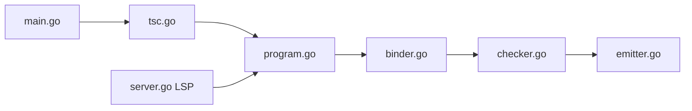

# microsoft/TypeScript

> Langage qui ajoute des types optionnels à JavaScript et le compile en JavaScript standard, pour projets de grande taille.

## Le problème
Les gros codebases JavaScript deviennent fragiles sans types ni outillage d'édition fiable.

## Ce que ça fait vraiment
Analyse les sources, vérifie les types, signale les erreurs et émet du JavaScript lisible plus des fichiers de déclaration. Fournit aussi un serveur de langage pour l'éditeur (complétion, navigation, refactorisation), un mode watch et des builds incrémentaux. Le code décrit par l'architecture est en Go (program.go, checker.go, server.go), avec une API native.

## Comment c'est branché


## Essayer
```bash
npm install -D typescript
npm install -D typescript@next
```
La seconde commande installe les builds nightly.

## Coût et pièges
Gratuit. La version nightly peut casser : à réserver aux tests.

## Ce que ce n'est pas
Pas un runtime : le code s'exécute après compilation en JavaScript. Les types disparaissent à l'exécution.

## Alternatives
Aucune alternative nommée dans le README.

## Pour toi
Adopter pour tout code JS/Node (outils MCP, dashboards) : les types attrapent les erreurs avant l'exécution, au prix d'une étape de compilation.

