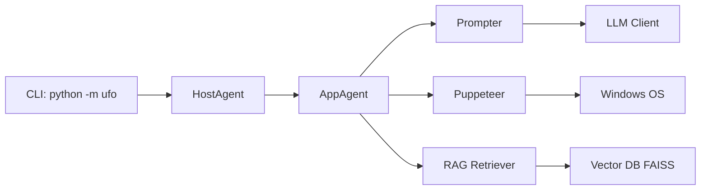

# microsoft/UFO

> Agent GUI de Microsoft Research qui automatise Windows (UFO²) et orchestre plusieurs appareils (Galaxy).

## Le problème
Automatiser des tâches multi-applications sur un poste Windows, ou réparties entre Windows, Linux et Android, suppose aujourd'hui des scripts fragiles par application.

## Ce que ça fait vraiment
UFO² : un HostAgent découpe la demande, des AppAgents par application suivent une boucle ReAct et agissent via UIA/Win32/COM ou clics GUI (Puppeteer), avec RAG sur docs et traces. UFO³ Galaxy : un ConstellationAgent transforme la demande en DAG de tâches, assignées à des agents d'appareils via le protocole AIP sur WebSocket. UFO² est en support long terme, Galaxy en développement actif.

## Comment c'est branché


## Essayer
```bash
pip install -r requirements.txt
copy config\ufo\agents.yaml.template config\ufo\agents.yaml
python -m ufo --task <task_name>
python -m galaxy --interactive
```

## Coût et pièges
Clé OpenAI ou Azure OpenAI (ou autre modèle) à ta charge, chaque tâche multiplie les appels LLM. UFO² exige Windows ; Galaxy demande de configurer serveurs, clients et MCP par appareil.

## Ce que ce n'est pas
Pas un outil RPA déterministe : les actions dépendent du LLM. Galaxy est présenté par ses auteurs comme adapté à l'expérimentation et aux flux non critiques.

## Alternatives
- TaskWeaver : agent « code-first » de Microsoft orienté analytique de données, si le besoin est de l'analyse plutôt que du pilotage d'interface.

## Pour toi
À surveiller : référence sérieuse (entreprise, papiers, benchmarks WAA/OSWorld) pour l'automatisation d'interfaces, mais hors du cœur data/MLOps sauf si tu dois piloter des applications Windows.
