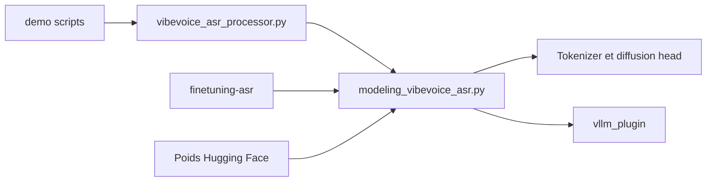

# microsoft/VibeVoice

> Famille de modèles vocaux ouverts (reconnaissance de la parole et synthèse) de Microsoft, à visée de recherche.

## Le problème
Les modèles de transcription classiques découpent l'audio en courts morceaux et perdent le contexte et l'identité des locuteurs sur de longs enregistrements.

## Ce que ça fait vraiment
VibeVoice-ASR traite jusqu'à 60 minutes en une passe et renvoie qui parle, quand et quoi, avec des mots-clés personnalisés ; une variante en flux transcrit pendant l'arrivée du son, une variante BitNet vise le CPU. Le dépôt contient aussi VibeVoice-Realtime-0.5B (TTS temps réel). Le code de VibeVoice-TTS long format a été retiré après des usages détournés. Le modèle repose sur des tokenizers continus à 7,5 Hz, un LLM et une tête de diffusion ; serveur vLLM et réglage LoRA fournis.

## Comment c'est branché

## Essayer
Aucune commande documentée dans ce README : voir les liens de documentation, Playground et Colab.

## Coût et pièges
Poids à télécharger depuis Hugging Face ; matériel GPU non chiffré ici pour le modèle 7B. Le README déconseille un usage commercial sans tests supplémentaires et signale un risque de deepfakes.

## Ce que ce n'est pas
Ce n'est pas une offre prête pour la production, et la synthèse longue (VibeVoice-TTS) est désactivée dans ce dépôt.

## Alternatives
Aucune alternative nommée dans le README.

## Pour toi
Surveiller : la transcription de longues réunions est un vrai besoin, mais le projet reste de recherche et sans usage commercial recommandé.

