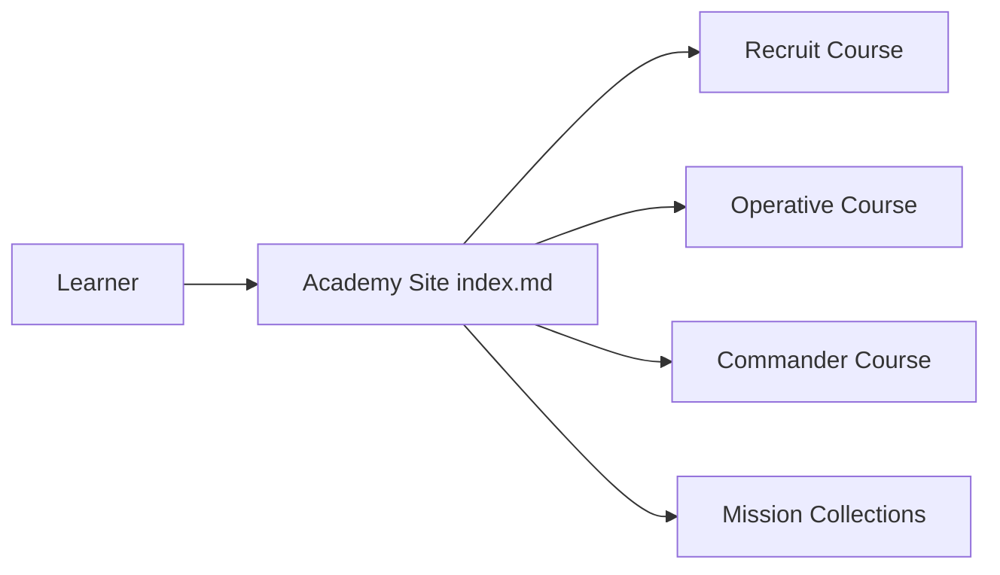

# microsoft/agent-academy

> Cours en trois parties de Microsoft pour apprendre à construire des agents avec Copilot Studio.

## Le problème
Les débutants sur Microsoft Copilot Studio n'ont pas de parcours guidé pour construire un agent.

## Ce que ça fait vraiment
Le README ne contient presque rien : il annonce un cours en trois parties hébergé sur aka.ms/agent-academy. D'après la structure du dépôt, le site propose les cours Recruit, Operative et Commander (versions Nextgen/Preview), des collections de missions, des événements et des pages produit/industrie.

## Comment c'est branché

## Essayer
Aucune commande : le contenu se lit sur https://aka.ms/agent-academy. Commande non documentée dans le README.

## Coût et pièges
Suppose un accès à Microsoft Copilot Studio (licence ou essai) ; le README ne précise pas le coût.

## Ce que ce n'est pas
Pas un outil ni du code réutilisable : un site de formation. Matière insuffisante dans le README pour aller plus loin.

## Alternatives
Aucune alternative nommée dans le README.

## Pour toi
À ignorer sauf si ton équipe adopte Copilot Studio : c'est un support de formation propriétaire, sans apport pour un profil data/IA hors écosystème Microsoft.

