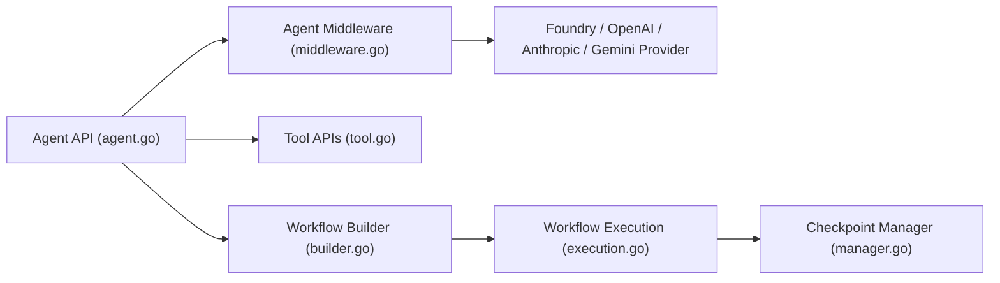

# microsoft/agent-framework-go

> Implémentation Go de Microsoft Agent Framework pour agents et workflows multi-agents à base de graphes.

## Le problème
Un agent au-delà du prompt unique exige orchestration, reprise sur incident, contrôle humain et observabilité.

## Ce que ça fait vraiment
API d'agents avec sessions, middleware (journaux, OpenTelemetry, approbation d'outils), compactage de contexte, fournisseurs OpenAI, Foundry, Anthropic et Gemini, outils (fonctions, MCP, shell), interopérabilité A2A et AG-UI. Le moteur de workflows gère séquentiel, concurrent, routage conditionnel, checkpoints et demandes externes. Absents : workflows déclaratifs, RAG, CodeAct, DevUI, handoff.

## Comment c'est branché


## Essayer
```bash
go get github.com/microsoft/agent-framework-go
az login
```
Le démarrage rapide définit `FOUNDRY_PROJECT_ENDPOINT` et `FOUNDRY_MODEL`.

## Coût et pièges
Le README annonce une préversion publique, en évolution hors du dépôt principal. Il faut un point d'accès de fournisseur (Foundry, Azure OpenAI, OpenAI…) et vos identifiants. Le README avertit que les systèmes tiers sont sous votre responsabilité (données, coûts).

## Ce que ce n'est pas
Pas à parité avec la version .NET : plusieurs fonctions ne sont pas implémentées en Go. Aucune télémétrie Microsoft par défaut.

## Alternatives
- Implémentations .NET et Python du dépôt amont Microsoft Agent Framework : plus de fonctions.

## Pour toi
À surveiller si tu es en Go et sur l'écosystème Microsoft : bon cadre d'orchestration, mais préversion incomplète face aux versions Python et .NET.
