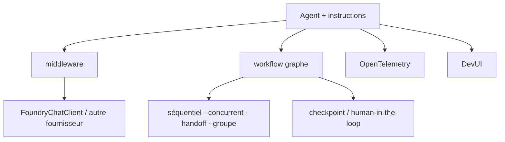

# microsoft/agent-framework

> Framework multi-langage Microsoft pour agents et workflows multi-agents en .NET, Python et Go.

## Le problème
Passer d'un prototype d'agent à un système exploitable demande durabilité, reprise sur incident,
observabilité et contrôle humain — que la boucle de chat sans état ne fournit pas.

## Ce que ça fait vraiment
MAF propose des API cohérentes entre Python et C#/.NET (le SDK Go vit dans
`microsoft/agent-framework-go`), un système de middleware pour le traitement requête/réponse, et des
workflows orientés graphe : séquentiel, concurrent, passage de relais, collaboration de groupe, avec
checkpointing, streaming, human-in-the-loop et voyage dans le temps. S'y ajoutent des agents
déclaratifs en YAML, des Agent Skills, l'hébergement Foundry en deux lignes, une DevUI de débogage,
l'observabilité OpenTelemetry native, et des guides de migration depuis Semantic Kernel et AutoGen.

## Comment c'est branché


## Essayer
```bash
pip install agent-framework
```
```bash
dotnet add package Microsoft.Agents.AI
dotnet add package Microsoft.Agents.AI.Foundry
dotnet add package Azure.AI.Projects
dotnet add package Azure.Identity
az login
```

## Coût et pièges
Le framework est ouvert, les modèles non. Le chemin par défaut passe par Microsoft Foundry / Azure
OpenAI : `az login`, `FOUNDRY_PROJECT_ENDPOINT`, `AZURE_AI_PROJECT_ENDPOINT`. `DefaultAzureCredential`
est pratique en développement mais le README conseille une identité explicite en production, pour
éviter latence et sondage de credentials.

## Ce que ce n'est pas
Ce n'est pas neutre vis-à-vis du cloud : la flexibilité fournisseur est annoncée, mais les exemples
et l'hébergement tournent autour d'Azure. Microsoft précise que tout usage de systèmes tiers
(serveurs, agents, modèles non-Azure) se fait à tes risques, sous leurs propres licences, et qu'il
t'incombe d'ajouter tes propres garde-fous de sécurité et de contenu.

## Alternatives
Le README ne compare pas, mais documente la migration depuis Semantic Kernel et depuis AutoGen —
les deux prédécesseurs Microsoft que MAF remplace.

## Pour toi
Le candidat naturel si ton entreprise est déjà sur Azure ; sinon l'adhérence à Foundry pèse plus que
le graphe de workflow ne rapporte.
