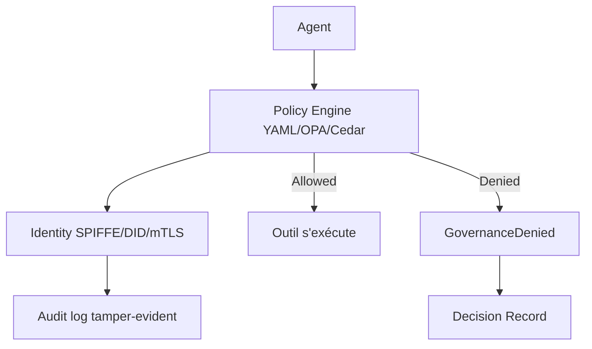

# microsoft/agent-governance-toolkit

> Boîte à outils multi-langage pour gouverner des agents IA : politiques, identité, sandbox, audit.

## Le problème
Une fois déployés, les agents décident seuls : appels d'outils, requêtes DB, délégation. Trois questions restent : l'action est-elle autorisée ? quel agent l'a faite ? peut-on le prouver ? La sécurité au niveau du prompt n'est pas une surface de contrôle (100 % de succès d'attaque rapporté sur GPT-4o, Claude 3, Llama-3).

## Ce que ça fait vraiment
Intercepte chaque appel d'outil, envoi de message et délégation dans du code applicatif déterministe **avant** que l'intention du modèle n'atteigne le réseau : les actions refusées sont structurellement impossibles. `govern(my_tool, policy="policy.yaml")` vérifie, journalise et lève `GovernanceDenied`. Politiques YAML/OPA/Cedar, identité SPIFFE/DID/mTLS, audit tamper-evident. SDK Python (stack complète), TypeScript, .NET, Rust, Go. Sandboxing à quatre anneaux de privilège, kill switch, MCP Security Gateway. 992 tests de conformité.

## Comment c'est branché


## Essayer
```bash
pip install "agent-governance-toolkit[full]"
```
```bash
agt doctor
agt red-team scan ./prompts/ --min-grade B
```

## Coût et pièges
Gratuit. Public Preview : ruptures possibles avant GA. Python 3.10/3.11+ selon module. Gouvernance au niveau middleware applicatif, **pas** kernel OS : recommandation de conteneuriser chaque agent. Migration v4→v5 obligatoire (ACS). Fonctions Azure optionnelles (credentials).

## Ce que ce n'est pas
Pas une défense au niveau du prompt : contrôle déterministe dans le code. Pas une isolation OS : à compléter par des conteneurs.

## Alternatives
Non nommées comme substituts (exemples d'intégration : OpenAI Agents SDK, CrewAI, smolagents).

## Pour toi
Pertinent si tu déploies des agents IA en prod et dois prouver conformité (OWASP, EU AI Act, SOC2) ; à suivre (Preview).
