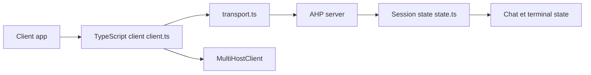

# microsoft/agent-host-protocol

> Protocole d'état synchronisé entre un serveur de sessions d'agents IA et plusieurs clients.

## Le problème
Plusieurs interfaces doivent afficher la même session d'agent sans état divergent ni couplage à un seul éditeur.

## Ce que ça fait vraiment
Définit un protocole (état immuable, réducteurs purs, réconciliation en écriture anticipée) et publie des SDK clients : Rust, TypeScript, Kotlin, Go, Swift, .NET ; certains offrent un `MultiHostClient`. Domaines d'état : racine, session, chat, changeset, automatisation, terminal. Serveur de référence : l'agent host de VS Code. Les clients AHPX et VS Code existent.

## Comment c'est branché


## Essayer
```bash
npm install
npm run docs:dev
npm run docs:build
```

## Coût et pièges
Gratuit. Chaque SDK suit son propre SemVer ; la spécification est jeune (créée en mars 2026). Les commandes ci-dessus concernent seulement le site de documentation.

## Ce que ce n'est pas
Pas un agent ni un serveur autonome : une spécification et des clients. Le seul serveur de référence est dans VS Code.

## Alternatives
Aucune alternative citée dans le README.

## Pour toi
À surveiller : à lire si tu construis une interface d'agents multi-clients ; sinon prématuré.

