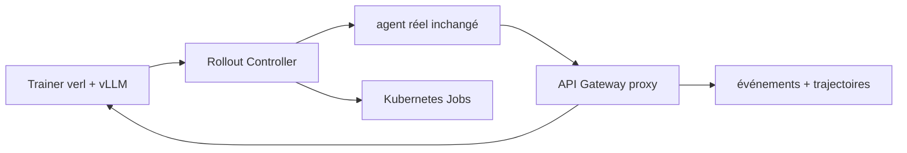

# microsoft/agent-lightning

> Entraîne par renforcement un agent existant sans modifier son code, via un proxy de modèle.

## Le problème
Appliquer du RL à un agent oblige d'ordinaire à réécrire sa boucle pour exposer états et récompenses.
On finit par entraîner une version simplifiée de l'agent, pas celui qui tourne vraiment.

## Ce que ça fait vraiment
L'agent parle au modèle à travers un proxy : outils, contexte, flux de contrôle et environnement restent en place.
Trois composants seulement : Trainer (`verl` + vLLM), API Gateway (proxy et capture), Rollout Controller.
Les agents tournent en local ou comme Jobs Kubernetes, sans service de bac à sable externe.
Résultat annoncé sur l'exemple de codage : SWE-bench Verified de 41,8 % à 56,4 % avec 6 000 échantillons.

## Comment c'est branché


## Essayer
```bash
cd <this-repo>
uv sync
bash scripts/setup_verl.sh 0.8.0 cu130
```
Les exemples vont de Calc-X (un seul GPU) à GSM8K, ScienceWorld, Search-R1, LLM-in-Sandbox et Coding Agent.

## Coût et pièges
La pile GPU `verl` est le vrai prérequis ; l'exemple d'installation cible CUDA 13.0.
Seul Calc-X est annoncé comme tenant sur un GPU : le reste suppose un cluster.

## Ce que ce n'est pas
Pas un cadre d'agents : il entraîne des agents écrits ailleurs, il ne remplace pas leur harnais.
Pas la v0 : le projet a été entièrement refondu en v1.0, les versions antérieures vivent sur une autre branche.
Pas un produit : ~3 500 lignes assumées, avec certification Responsible AI mais sans engagement de service.

## Alternatives
`Tinker` — combinaison documentée dans un article du projet pour ajuster n'importe quel agent.

## Pour toi
À suivre : c'est la voie crédible pour faire du RL sur un agent réel, mais la facture GPU reste le verrou.
