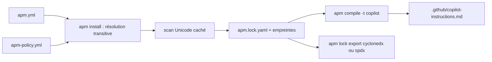

# microsoft/apm

> Gestionnaire de dépendances pour la configuration des agents de code, façon npm.

## Le problème
Standards, prompts, skills et greffons d'agent s'installent à la main, différemment chez chacun.
Rien n'est portable ni reproductible entre deux machines ou deux clients.

## Ce que ça fait vraiment
Un `apm.yml` déclare toutes les dépendances agentiques ; `apm install` les résout, transitivement comprises.
`apm.lock.yaml` épingle l'arbre résolu avec des empreintes d'intégrité, comme un `package-lock.json`.
Un même manifeste se déploie vers Copilot, Claude, Cursor, Codex, Gemini, Windsurf, Kiro et OpenCode.
`apm-policy.yml` laisse une équipe sécurité restreindre sources, portées et primitives, avec héritage restrictif.

## Comment c'est branché


## Essayer
```bash
brew install apm
apm install microsoft/apm-sample-package#v1.0.0
apm compile -t copilot
```

## Coût et pièges
Gratuit, sans compte. Les serveurs MCP transitifs demandent un consentement explicite à l'installation.
`apm audit` reconstruit le contexte dans un espace temporaire et le compare à ton arbre de travail.

## Ce que ce n'est pas
Pas un bac à sable d'exécution : la politique régit ce qui est installé, pas ce qui tourne.
Pas un SBOM de conformité — l'export est un inventaire de provenance, pas une attestation.
Pas un catalogue : les paquets viennent de dépôts git ou de places de marché tierces.

## Alternatives
`npx skills add`, dont APM reprend le geste d'installation.
agentrc, présenté comme complémentaire pour générer les instructions à empaqueter.

## Pour toi
À suivre si tu commences à partager des skills entre projets ; encore jeune pour en dépendre.
