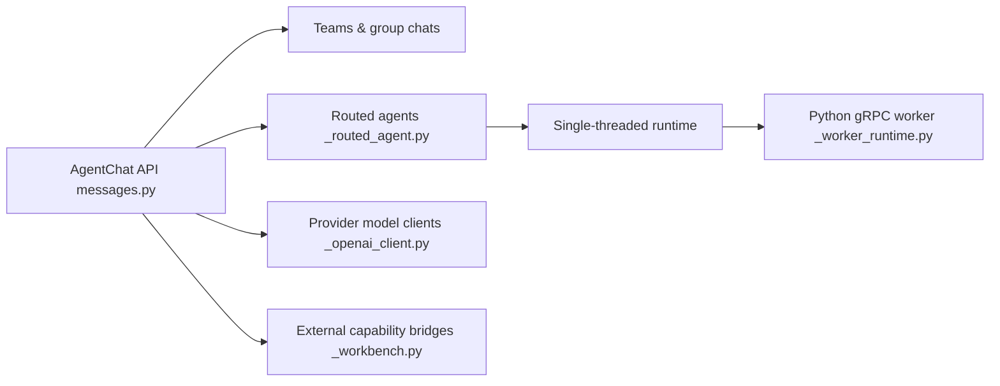

# microsoft/autogen

> Framework multi-agents LLM en Python/.NET, désormais en mode maintenance au profit d'Agent Framework.

## Le problème
Orchestrer plusieurs agents LLM, leurs outils et leurs tours de parole demande sinon beaucoup de plomberie maison.

## Ce que ça fait vraiment
Trois couches : Core (runtime événementiel, messages, topics), AgentChat (AssistantAgent, équipes round-robin, selector, swarm, graphe, Magentic-One), Extensions (clients OpenAI, Anthropic, Ollama ; exécution de code Docker/Jupyter ; MCP).
Runtime distribué gRPC avec passerelle .NET.
AutoGen Studio : GUI no-code de prototypage ; AGBench pour l'évaluation.
**Mode maintenance** : correctifs seulement, gestion communautaire.

## Comment c'est branché


## Essayer
```bash
pip install -U "autogen-agentchat" "autogen-ext[openai]"
pip install -U "autogenstudio"
autogenstudio ui --port 8080 --appdir ./my-app
```

## Coût et pièges
Les exemples appellent l'API OpenAI : clé et facture à ta charge. Les serveurs MCP peuvent exécuter des commandes locales.

## Ce que ce n'est pas
Plus le choix recommandé par Microsoft pour un nouveau projet. Studio n'est pas une appli de prod (pas d'auth). Licence CC-BY-4.0 pour la doc, MIT pour le code.

## Alternatives
- microsoft/agent-framework : successeur officiel, support long terme.

## Pour toi
Ignorer pour du neuf ; migrer vers Agent Framework si tu as de l'existant.
