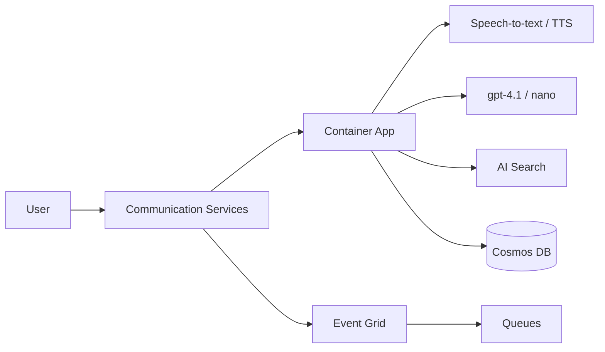

# microsoft/call-center-ai

> Preuve de concept de centre d'appels vocal IA sur Azure et GPT, pour équipes cloud.

## Le problème
Automatiser des appels téléphoniques (entrants/sortants) avec compréhension, collecte de données et transfert humain demande d'assembler beaucoup de services.

## Ce que ça fait vraiment
Un `POST /call` lance un appel ; la conversation passe par STT, GPT-4.1/nano, TTS en streaming via Azure Communication Services.
Remplit un « claim » selon un schéma configurable, crée rappels et synthèse, stockés dans Cosmos DB.
RAG sur Azure AI Search, cache Redis, files Azure Storage, Event Grid ; transfert vers un agent humain.
Feature flags via App Configuration, traces Application Insights.

## Comment c'est branché


## Essayer
```bash
az login
make deploy name=my-rg-name
make logs name=my-rg-name
make deploy-bicep deploy-post name=my-rg-name
make tunnel
make dev
python3 -m tests.local
```

## Coût et pièges
Environ 720 $/mois estimés pour 1000 appels de 10 minutes, plus ~343 $ optionnels (monitoring) ; numéro de téléphone à acheter.
Entièrement lié à Azure.

## Ce que ce n'est pas
Pas prêt pour la production : le README le dit et liste ce qui manque (réseau privé, multi-région…).
Pas portable hors Azure.

## Alternatives
- VoiceRAG : exemple plus simple avec gpt-4o-realtime, local.
- Realtime Call Center Solution Accelerator : plus facile à déployer sur Azure.

## Pour toi
À surveiller si tu travailles sur Azure : architecture de référence voix + RAG bien documentée, avec chiffrage honnête des coûts.
