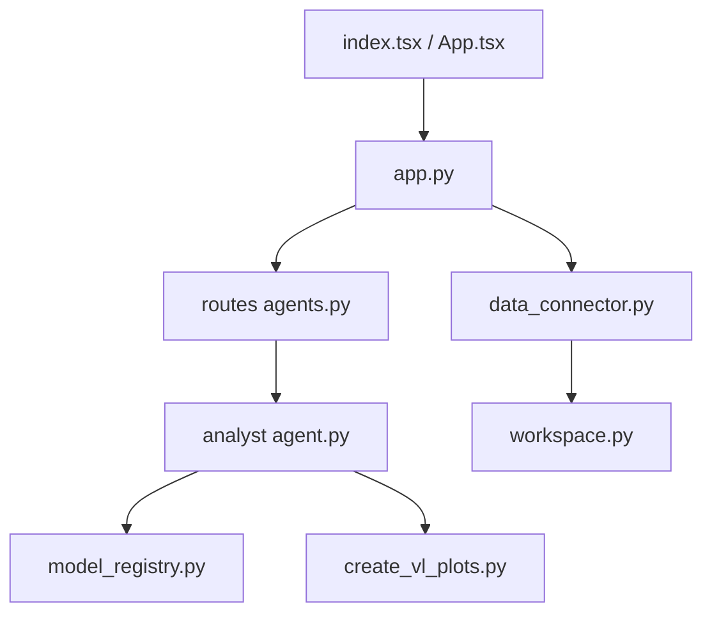

# microsoft/data-formulator

> Espace de travail local où un agent IA explore des données et produit des graphiques éditables.

## Le problème
Les données sont dispersées entre fichiers, bases et entrepôts. Et une longue conversation fait perdre le fil d'une exploration qui part dans plusieurs directions.

## Ce que ça fait vraiment
On charge des fichiers CSV, Excel, JSON, des captures d'écran ou du texte, ou on se connecte à PostgreSQL, BigQuery, Databricks, Kusto, S3.
Les « Data Threads » permettent de repartir de n'importe quelle étape pour tenter une autre analyse.
L'agent génère des graphiques Flint/Vega-Lite dans un bac à sable, puis assemble un rapport.
Les modèles OpenAI, Azure, Ollama et Anthropic passent par LiteLLM. L'API est en Python, l'interface en React.

## Comment c'est branché


## Essayer
```bash
uvx data_formulator
pip install data_formulator
python -m data_formulator
docker compose up --build
```

## Coût et pièges
Le fournisseur de LLM est à ta charge, sauf si tu utilises Ollama. Les builds de bureau ne sont pas signés.

## Ce que ce n'est pas
Ce n'est pas un outil BI d'équipe avec gouvernance : c'est un projet de recherche Microsoft, local d'abord. Il ne remplace pas un notebook pour les analyses reproductibles.

## Alternatives
Le README ne nomme aucun dépôt alternatif. Il cite seulement Flint, son moteur de graphiques.

## Pour toi
À adopter : une installation `uvx` en une ligne, des connecteurs vers tes sources et un LLM local possible. C'est un bon accélérateur d'EDA à essayer tout de suite.
