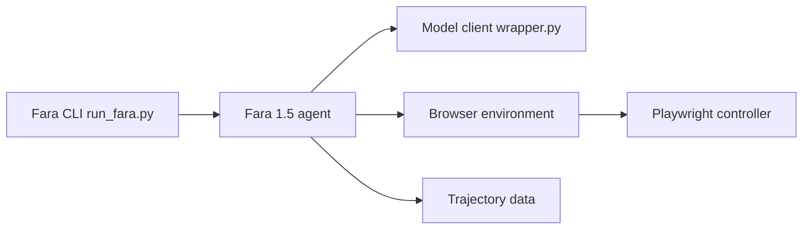

# microsoft/fara

> Famille de modèles Fara1.5 (4B, 9B, 27B) qui pilotent un navigateur à partir de captures d'écran.

## Le problème
Les agents web reposent souvent sur des arbres d'accessibilité et des modèles de parsing séparés.

## Ce que ça fait vraiment
Boucle observer-penser-agir : le modèle reçoit une capture d'écran et prédit directement clics, saisies, recherches web. Le dépôt contient la CLI `fara-cli`, un contrôleur Playwright, le cadre d'évaluation `webeval` (WebTailBench) et le Universal Verifier. Les modèles sont sur Microsoft Foundry ou en local avec vLLM.

## Comment c'est branché


## Essayer
```bash
git clone https://github.com/microsoft/fara.git
cd fara
python3 -m venv .venv
source .venv/bin/activate
pip install -e .
playwright install
fara-cli --task "whats the weather in new york now" --endpoint_config azure_foundry_config.json
```

## Coût et pièges
Endpoint Foundry payant à ta charge, ou GPU pour vLLM (contexte ≥ 15 000 tokens, température 0). « Research preview » : à exécuter en sandbox, sans données sensibles.

## Ce que ce n'est pas
Pas un produit fini. Le pipeline `webeval` documenté correspond à Fara-7B et est en cours de mise à jour.

## Alternatives
Compare à OpenAI Operator, Gemini 2.5 Computer Use et GPT-5 SoM dans ses benchmarks.

## Pour toi
À surveiller : référence utile pour expérimenter les agents d'usage d'ordinateur avec des petits modèles locaux, mais encore en préversion.

