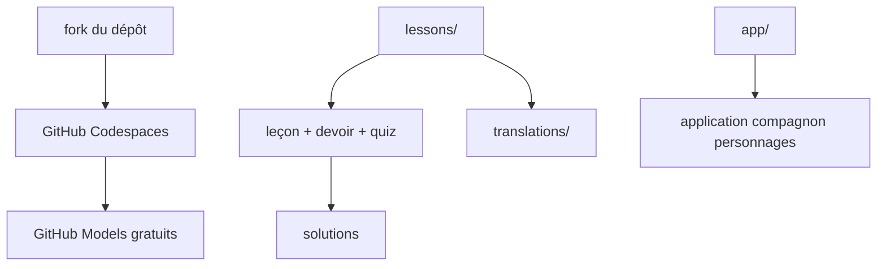

# microsoft/generative-ai-with-javascript

> Cours en huit leçons sur l'IA générative destiné aux développeurs JavaScript débutants.

## Le problème
Les ressources sur les LLM supposent presque toutes Python, ce qui laisse un développeur JavaScript sans chemin d'entrée.
Monter un environnement pour essayer un modèle est déjà un obstacle avant la première ligne de code.

## Ce que ça fait vraiment
Huit leçons progressives : fondamentaux des LLM, première application, prompt engineering, sortie structurée, RAG, appel d'outils, MCP, puis clients MCP enrichis par un LLM.
Chaque leçon comporte un texte, un devoir, un quiz, les corrigés et une courte vidéo.
Une application compagnon fait dialoguer avec des personnages historiques, sur un fil narratif de voyage dans le temps.
Une série de dix sessions vidéo complète le tout, avec slides, démos et scripts (LangChain.js, Ollama, Phi-3, Azure AI Foundry, Cosmos DB, AI Chat Protocol).

## Comment c'est branché

## Essayer
Aucune commande documentée : le parcours passe par le bouton **Fork**, puis l'onglet **Codespaces** et **Create codespace**.

## Coût et pièges
Codespaces et GitHub Models permettent de suivre le cours sans clé ni facture, mais imposent un compte GitHub.
Les exemples tournent aussi en local, sans que le README détaille la configuration à prévoir.

## Ce que ce n'est pas
Pas un cours avancé : le titre annonce « for beginners » et le contenu vise la découverte.
Pas une source factuelle : le dépôt contient du contenu fictif généré par IA, et les personnages historiques n'expriment pas de vraies positions.
Pas un cours Python : tout le code est en JavaScript.

## Alternatives
- Generative AI for Beginners : la version généraliste du même programme.
- Generative AI for Beginners .NET : la déclinaison .NET, si c'est ta pile.
- AI Agents for Beginners : suite logique si l'objectif est l'agentique plutôt que le LLM brut.

## Pour toi
Rien à y apprendre pour un profil data / IA confirmé ; utile seulement pour orienter un développeur front qui débute.
