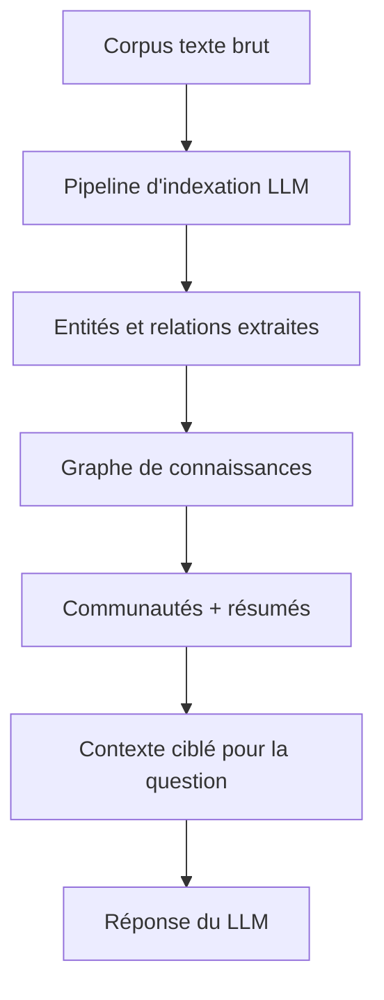

# microsoft/graphrag

> Pipeline qui extrait un graphe de connaissances d'un corpus texte pour alimenter un LLM.

## Le problème
Un RAG vectoriel classique répond mal aux questions qui demandent d'agréger des faits dispersés dans tout un corpus.
Sans structure, le modèle ne voit que des morceaux isolés, jamais la vue d'ensemble.

## Ce que ça fait vraiment
Suite de transformation qui extrait des données structurées de texte non structuré à l'aide d'un LLM.
Construit des structures de mémoire en graphe de connaissances, utilisées ensuite comme contexte ciblé pour la question posée.
Fournit un démarrage en ligne de commande (`graphrag init`), un guide de réglage de prompts et un notebook de migration entre versions majeures.
Le dépôt est explicitement en mode maintenance depuis l'avertissement en tête de README : correctifs de bugs et de dépendances, pas de nouvelles fonctionnalités ni de PR acceptées.

## Comment c'est branché


## Essayer
```bash
graphrag init --root [path] --force
```

## Coût et pièges
Le README avertit lui-même : l'indexation GraphRAG est une opération coûteuse, à lire en entier avant de lancer, et à démarrer petit.
Clé d'API LLM à votre charge ; `graphrag init --force` écrase configuration et prompts, donc à sauvegarder avant.

## Ce que ce n'est pas
Ce n'est pas un produit Microsoft supporté : le README le présente comme une démonstration de méthodologie, pas une offre officielle.
Ce n'est pas un projet actif : mode maintenance assumé, pas de nouvelles fonctionnalités.
Ce n'est pas utilisable tel quel sur vos données : le README recommande de régler les prompts avant d'espérer de bons résultats.

## Alternatives
Aucune alternative n'est nommée dans le README.

## Pour toi
À connaître comme référence méthodologique du RAG sur graphe, pas à mettre en production en 2026.
