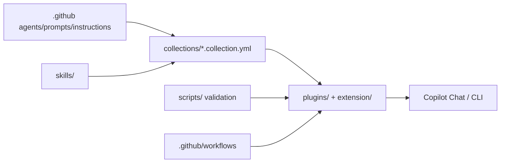

# microsoft/hve-core

> Bibliothèque d'agents, prompts et instructions pour GitHub Copilot, structurée autour du cycle Research, Plan, Implement, Review.

## Le problème
Chaque équipe réinvente ses prompts et conventions pour Copilot, sans standards partagés ni validation.

## Ce que ça fait vraiment
Un dépôt de contenu (pas d'application) : agents spécialisés, prompts, instructions de code, compétences (skills) regroupés en collections et paquetés en extensions VS Code et en plugin pour Copilot CLI. Il y a une méthode RPI, des agents pour GitHub, Azure DevOps, Jira, une chaîne de validation par scripts PowerShell, et un site Docusaurus.

## Comment c'est branché


## Essayer
```bash
copilot plugin marketplace add microsoft/hve-core
copilot plugin install hve-core@hve-core
```

## Coût et pièges
Le dépôt est gratuit ; l'usage suppose GitHub Copilot (abonnement non précisé dans le README). Certaines compétences dérivées d'OWASP sont sous CC BY-SA 4.0.

## Ce que ce n'est pas
Le README avertit : cadre très opinioné et évolutif, à traiter comme source de patterns, pas comme plateforme stable ni dépendance de production. Des changements incompatibles sont annoncés.

## Alternatives
Aucune alternative nommée dans le README.

## Pour toi
À surveiller : des patrons de prompts et de workflows agentiques à copier, mais à ne pas adopter comme dépendance.
