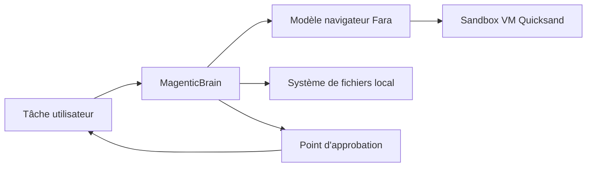

# microsoft/magentic-ui

> Agent navigateur et fichiers conçu pour tourner avec de petits modèles, sous supervision.

## Le problème
Les agents qui remplissent des formulaires ou font de la recherche web exigent des modèles de pointe,
donc du calcul coûteux, et agissent souvent sans point d'arrêt avant une action critique.

## Ce que ça fait vraiment
MagenticLite associe un orchestrateur exécutable en local (MagenticBrain) à un modèle spécialisé
navigateur (Fara). Il travaille à la fois dans le navigateur et sur le système de fichiers local :
recherche web, remplissage de formulaires, rangement de fichiers dans un même flux. L'utilisateur peut
orienter, approuver ou reprendre la main à tout moment, et l'agent s'arrête pour demander avant une
action critique. Les sessions de navigation tournent dans une VM légère (Quicksand).

## Comment c'est branché


## Essayer
```bash
mkdir magentic-lite && cd magentic-lite
uv venv --python=3.12 --seed .venv
source .venv/bin/activate
uv pip install "magentic_ui>=0.2.0"
magentic-ui --port 8081
```

## Coût et pièges
Il faut connecter un endpoint de modèle, à monter soi-même ou à louer : coût à votre charge.
Supporté sur macOS et Windows via WSL ; les autres plateformes renvoient au guide d'installation.
La version 0.1, pensée pour les modèles frontière, survit sur une branche séparée.

## Ce que ce n'est pas
Pas un agent autonome : il s'arrête et demande avant les actions sensibles, par conception.
Pas exhaustif — le dépôt publie une page « Limitations » listant ce qu'il gère mal, et une note de
transparence sur les risques et les usages prévus. Aucune licence dans le README.

## Alternatives
Aucun dépôt alternatif n'est nommé dans le README.

## Pour toi
À tester si tu veux évaluer ce qu'un petit modèle sait faire en automatisation navigateur.
