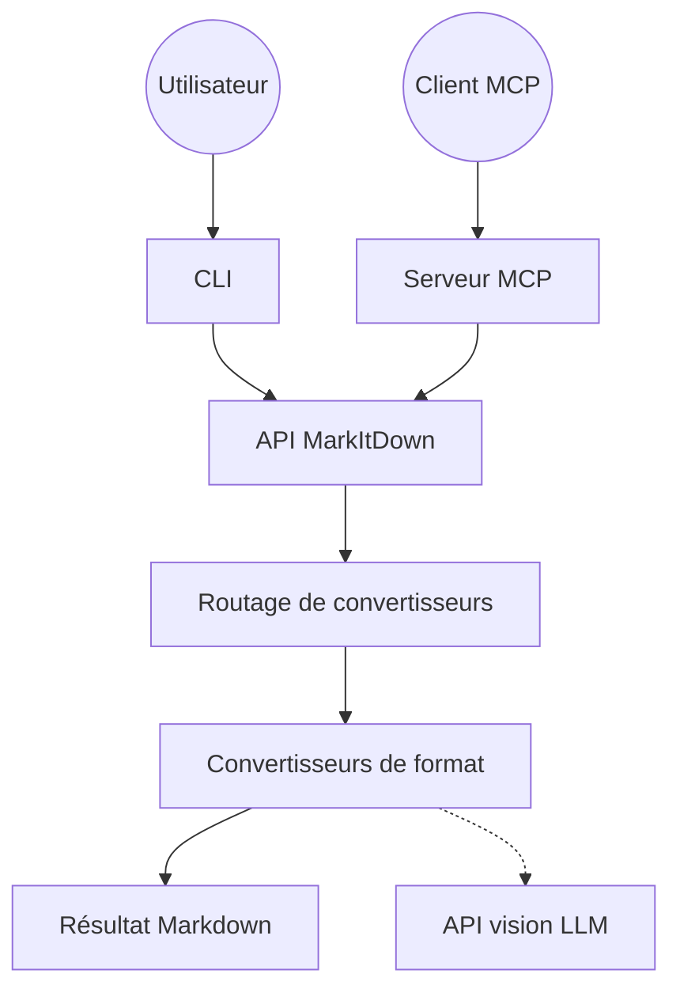

# microsoft/markitdown

> Convertisseur de PDF, Office, images et audio vers du Markdown destiné aux pipelines LLM.

## Le problème
Un corpus hétérogène (PDF, DOCX, XLSX, PPTX, ZIP, EPUB) n'entre pas tel quel dans un LLM.
Les extracteurs génériques rendent du texte plat et perdent titres, listes et tableaux.

## Ce que ça fait vraiment
Convertit une quinzaine de formats en Markdown en préservant la structure du document.
Dépendances optionnelles par format (`[pdf]`, `[docx]`, `[xlsx]`, `[audio-transcription]`…).
Système de plugins tiers, désactivés par défaut, dont `markitdown-ocr` qui passe par un LLM vision.
Deux connecteurs Azure optionnels : Document Intelligence et Content Understanding (audio, vidéo, champs).

## Comment c'est branché


## Essayer
```bash
pip install 'markitdown[all]'
markitdown path-to-file.pdf > document.md
cat path-to-file.pdf | markitdown
markitdown --list-plugins
```

## Coût et pièges
Gratuit en local. Les chemins Azure (`--use-cu`, `-d`) facturent chaque appel `convert()`.
Python 3.10+. L'entrée n'est pas assainie : `convert()` lit fichiers locaux ET URLs distantes.

## Ce que ce n'est pas
Pas un outil de conversion haute fidélité pour lecture humaine — la sortie vise l'analyse automatique.
Pas un OCR : l'OCR passe par un plugin et une clé de modèle vision, silencieusement ignoré sans client.
Le projet refuse par principe serveurs web, API hébergées et interfaces graphiques.

## Alternatives
- `PaddlePaddle/PaddleOCR` : si les documents sont scannés et que la mise en page compte.
- `unclecode/crawl4ai` : si la source est du web plutôt que des fichiers bureautiques.

## Pour toi
Le convertisseur par défaut d'un pipeline d'ingestion documentaire. À installer sans hésiter.
