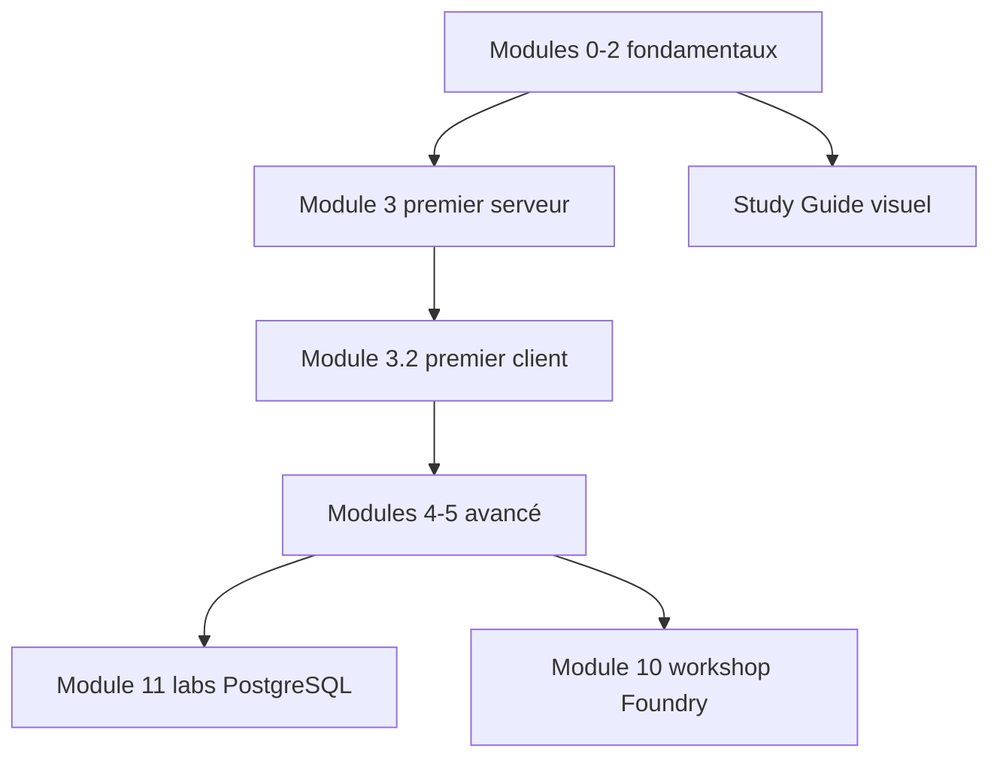

# microsoft/mcp-for-beginners

> Cursus Microsoft pour apprendre le Model Context Protocol, avec du code en six langages.

## Le problème
MCP bouge vite et sa spécification est datée (versions AAAA-MM-JJ) : lire la spec
seule ne dit ni par où commencer ni ce qui a changé.

## Ce que ça fait vraiment
Treize modules, du module 00 (introduction) au module 12 (outillage), avec labs.
Enseigne la révision courante `2026-07-28` — requêtes sans état, framework
Extensions, dépréciation de Roots/Sampling/Logging — tout en gardant des exemples
épinglés à `2025-11-25` le temps que les SDK suivent. Exemples calculatrice puis
avancés en C#, Java, JavaScript, Python, TypeScript, Rust. Module 11 : 13 labs
d'intégration PostgreSQL (RLS, multi-tenant, pgvector, Azure Container Apps).

## Comment c'est branché


## Essayer
```bash
git clone https://github.com/microsoft/mcp-for-beginners.git
```

## Coût et pièges
Gratuit, licence MIT. Les modules Azure (5.1, 5.12, 5.13, labs 03/10/11) supposent
un abonnement Azure ; les exemples pgvector supposent une clé Azure OpenAI.

## Ce que ce n'est pas
Ce n'est pas la spécification ni un SDK : c'est un support pédagogique qui renvoie
vers la doc officielle. Le ton est très encourageant et répétitif ; la matière
utile tient dans les tables de modules. Le décalage assumé entre la version
enseignée et celle des exemples peut dérouter.

## Alternatives
- MCP GitHub Repository : les SDK et exemples officiels, sans le parcours.
- MCP Specification : la référence, sans progression pédagogique.

## Pour toi
Bonne carte du territoire MCP à parcourir une fois ; le module 11 est le seul
morceau vraiment réutilisable en MLOps.
