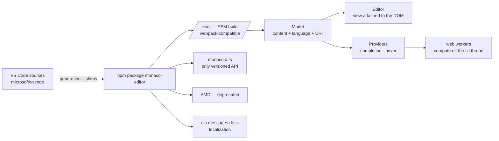

# microsoft/monaco-editor

> **VS Code's code editor, packaged as a web component you embed in your own page.**

## The problem

Putting a code editor inside a web application — a query console, a notepad, a configuration
form — otherwise means bolting syntax highlighting, completion, folding and undo history onto
a `textarea` yourself, for a result that still falls short of the desktop editor your users
already know.

## What it actually does

Monaco is VS Code's editing component extracted for the browser. The README is blunt about the
mechanism: the code is *generated straight from VS Code's sources*, with shims around the
services it needs to run outside its home.

The library exposes four concepts, and the README insists you understand them before writing
any integration code. **Models** hold the content, its language and its edit history; each
model is identified by a unique **URI** (`inmemory://model/1` by default), and the README
recommends mirroring a virtual file system under a `file:///` base, because some smart
features depend on that URI — TypeScript import resolution, picking the right JSON schema.
**Editors** are the view attached to the DOM. **Providers** supply completion and hover
information; the README relates them to, without equating them with, Language Server Protocol
features.

The npm package ships an ESM build under `/esm` (webpack-compatible) and `monaco.d.ts` — which
the README states is the only versioned surface, everything else being private and free to
break on any release. Localization loads an `nls.messages.<lang>.js` script before the editor.
Objects expose `.dispose()`, which you must call to free a model's URI and detach an editor's
listeners.

## How it is wired



No code-derived diagram exists for this repository: the graph above is reconstructed from the
README alone. The point is the top arrow — Monaco has no upstream life of its own, it is
produced from VS Code — and the model / editor / providers split, which is the backbone of
every integration.

## Trying it

```
> npm install monaco-editor
```

To load the editor in German, the README gives the tag to include before the main script:

```html
<script src="path/to/monaco-editor/esm/nls.messages.de.js"></script>
```

The README documents no other command: no start script, no bootstrap snippet. It points
instead to the interactive playground
(`microsoft.github.io/monaco-editor/playground.html`), the complete samples under `./samples/`
and the `./docs/integrate-esm.md` guide.

## Cost and gotchas

- **Free, MIT, nothing to pay**: no API key, no account, no third-party service. The only
  requirement is a JavaScript build chain (npm, a bundler such as webpack).
- **Impossible from `file://`**: the README devotes a FAQ entry to the "Could not create web
  worker" warning. HTML5 forbids pages loaded over `file://` from creating web workers; serve
  the page over `http://` or `https://`. This is the first wall you hit.
- **Web workers everywhere**: language services spawn them to keep heavy computation off the
  UI thread. The README calls them cheap in resources, provided you get them working (see the
  cross-domain case).
- **Unstable API outside `monaco.d.ts`**: anything not in the declaration file "might break
  with any release". Integrations that reach into internals pay at every upgrade.
- **The AMD build is deprecated** and will be removed; it exists only for backwards
  compatibility.
- **Memory leaks** if you skip `.dispose()`: an unreleased model keeps its URI, and two models
  cannot share one.

## What it is not

- **It is not VS Code.** The README answers a flat "No" to whether a VS Code extension will run
  in Monaco — unless it is fully LSP-based with a JavaScript language server. No extension
  marketplace, no terminal, no file explorer: just the editing component.
- **It is not usable on mobile**: the FAQ answers "No" for mobile browsers and mobile web app
  frameworks. That is structural, not a bug to work around.
- **It is not a TextMate-grammar editor**: the README points to a third-party project,
  `bolinfest/monaco-tm`, which combines `vscode-oniguruma` and `vscode-textmate` to get there.
  Monaco's own languages go through Monarch, which you write yourself for a new language.
- **It is not versioned alongside VS Code**: the README states there is *no* relationship
  between the two version numbers.

## Alternatives

| | When to prefer it |
|---|---|
| **microsoft/vscode** | Named in the README's first line as the source Monaco is generated from. Prefer it when you want the full editor — extensions, terminal, workspace — rather than a component to embed in your own page. |
| **bolinfest/monaco-tm** | Cited in the FAQ: add it on top of Monaco when the requirement is specifically TextMate-grammar highlighting, which Monaco does not support. |

No neighbours were supplied with this repository; these two are the only projects named in the
README. Beyond them, no comparable alternative in the catalogue.

## For you

Adopt it as soon as an internal tool needs a code input area: a SQL console, a YAML or prompt
editor, a home-grown notebook cell, a pipeline configuration pane. It is the brick that turns a
form into something people accept using all day, at zero cost under an MIT licence. The budget
is integration, not licensing: understanding models / URIs / providers, serving the page over
HTTP, and depending only on `monaco.d.ts`. Skip it if you are targeting mobile, or if you hoped
to reuse existing VS Code extensions.
