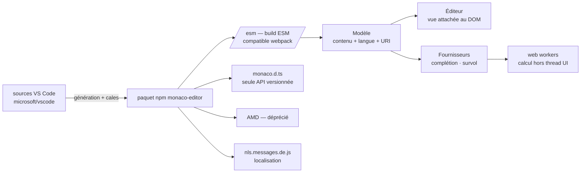

# microsoft/monaco-editor

> **L'éditeur de code de VS Code, empaqueté en composant web à intégrer dans sa propre page.**

## Le problème

Mettre un éditeur de code dans une application web — une console de requêtes, un cahier de
notes, un formulaire de configuration — oblige sinon à recoller soi-même coloration
syntaxique, complétion, repli de blocs et historique d'édition sur un `textarea`, pour un
résultat qui reste loin de ce que l'utilisateur connaît de son éditeur de bureau.

## Ce que ça fait vraiment

Monaco est le composant d'édition de VS Code extrait pour le navigateur. Le README est
explicite sur le mécanisme : le code est *généré directement depuis les sources de VS Code*,
avec des cales autour des services dont il a besoin pour tourner hors de son environnement
d'origine.

La bibliothèque expose quatre concepts, et le README insiste pour qu'on les distingue avant
d'écrire la première ligne. Les **modèles** portent le contenu, sa langue et son historique
d'édition ; chaque modèle est identifié par une **URI** unique (par défaut
`inmemory://model/1`), et le README recommande de simuler un système de fichiers virtuel avec
une base `file:///`, parce que certaines fonctions intelligentes dépendent de cette URI — la
résolution d'imports TypeScript, le choix du schéma JSON à appliquer. Les **éditeurs** sont la
vue attachée au DOM. Les **fournisseurs** (`providers`) branchent complétion et infobulles ;
le README les rapproche, sans les confondre, des fonctionnalités du Language Server Protocol.

Le paquet npm livre une version ESM dans `/esm`, compatible webpack, et `monaco.d.ts` — le
README précise que c'est *cette* déclaration d'API qui est versionnée, tout le reste étant
considéré privé et susceptible de casser à n'importe quelle publication. La localisation passe
par un script `nls.messages.<langue>.js` chargé avant l'éditeur. Les objets exposent
`.dispose()`, à appeler pour libérer l'URI d'un modèle et détacher les écouteurs d'un éditeur.

## Comment c'est branché



Aucun diagramme tiré du code n'existe pour ce dépôt : ce schéma est reconstruit depuis le seul
README. Le point à retenir est la flèche du haut — Monaco n'a pas de vie propre en amont, il
est produit à partir de VS Code — et la séparation modèle / éditeur / fournisseurs, qui est
l'ossature de toute intégration.

## Essayer

```
> npm install monaco-editor
```

Pour charger l'éditeur en allemand, le README donne la balise à insérer avant le script
principal :

```html
<script src="path/to/monaco-editor/esm/nls.messages.de.js"></script>
```

Le README ne documente aucune autre commande : pas de script de démarrage, pas d'exemple
d'amorçage en JavaScript. Il renvoie pour cela au bac à sable interactif
(`microsoft.github.io/monaco-editor/playground.html`), aux exemples complets du dossier
`./samples/` et au guide `./docs/integrate-esm.md`.

## Coût et pièges

- **Gratuit, MIT, rien à payer** : pas de clé d'API, pas de compte, pas de service tiers. Le
  seul prérequis est une chaîne de construction JavaScript (npm, empaqueteur type webpack).
- **Impossible depuis `file://`** : le README consacre une entrée de FAQ à l'avertissement
  « Could not create web worker ». HTML5 interdit aux pages chargées en `file://` de créer des
  web workers ; il faut servir la page en `http://` ou `https://`. C'est le premier mur qu'on
  rencontre.
- **Web workers partout** : les services de langage en créent pour sortir les calculs lourds du
  thread d'interface. Le README les dit peu coûteux en ressources, à condition de réussir à les
  faire fonctionner (cas des domaines croisés).
- **Surface d'API instable hors `monaco.d.ts`** : tout ce qui n'est pas dans le fichier de
  déclaration « peut casser à n'importe quelle publication ». Une intégration qui fouille dans
  l'interne se paiera à chaque montée de version.
- **Le build AMD est déprécié** et sera retiré ; il n'est là que pour la compatibilité.
- **Fuites mémoire** si on oublie `.dispose()` : un modèle non libéré garde son URI, et deux
  modèles ne peuvent pas partager la même.

## Ce que ce n'est pas

- **Ce n'est pas VS Code.** Le README répond non, sans nuance, à la question « mon extension
  VS Code marchera-t-elle dans Monaco ? » — sauf si elle repose entièrement sur LSP avec un
  serveur écrit en JavaScript. Pas de marché d'extensions, pas de terminal, pas d'explorateur
  de fichiers : juste le composant d'édition.
- **Ce n'est pas utilisable en mobile** : la FAQ répond non pour les navigateurs mobiles et les
  cadriciels d'application web mobiles. C'est structurel, pas un défaut à contourner.
- **Ce n'est pas un éditeur à grammaires TextMate** : le README renvoie à un projet tiers,
  `bolinfest/monaco-tm`, qui recolle `vscode-oniguruma` et `vscode-textmate` pour y arriver.
  Les langues de Monaco passent par Monarch, à écrire soi-même pour un langage nouveau.
- **Ce n'est pas versionné comme VS Code** : le README le dit, il n'y a *aucune* correspondance
  entre les deux numéros de version.

## Alternatives

| | Quand le préférer |
|---|---|
| **microsoft/vscode** | Nommé dès la première ligne du README comme la source dont Monaco est extrait. À préférer quand on veut l'éditeur complet — extensions, terminal, espace de travail — plutôt qu'un composant à encastrer dans sa propre page. |
| **bolinfest/monaco-tm** | Cité dans la FAQ : à ajouter par-dessus Monaco quand le besoin est précisément la coloration par grammaires TextMate, que Monaco ne gère pas. |

Aucun voisin n'a été fourni avec ce dépôt ; ces deux projets sont les seuls nommés dans le
README. Pour le reste, aucune alternative comparable dans le catalogue.

## Pour toi

À adopter dès qu'un outil interne a besoin d'une zone de saisie de code : console SQL, éditeur
de YAML ou de prompts, cellule de notebook maison, aire de configuration d'un pipeline. C'est
la brique qui transforme un formulaire en outil qu'on accepte d'utiliser toute la journée, pour
un coût de zéro et une licence MIT. Le budget à prévoir n'est pas la licence mais l'intégration :
comprendre modèles / URI / fournisseurs, servir la page en HTTP et ne s'appuyer que sur
`monaco.d.ts`. À ne pas choisir si la cible est mobile, ou si l'on espérait réutiliser des
extensions VS Code existantes.
