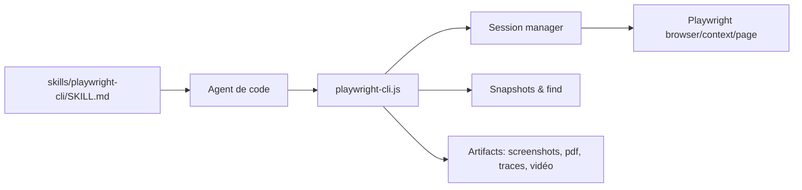

# microsoft/playwright-cli

> CLI Playwright avec skills pour agents de code, qui pilote un navigateur sans saturer le contexte.

## Le problème
Les agents de code qui pilotent un navigateur via MCP chargent de gros schémas d'outils et des arbres d'accessibilité, ce qui consomme des jetons.

## Ce que ça fait vraiment
Commandes courtes (`open`, `click`, `type`, `snapshot`, `screenshot`, `route`, `tracing-start`…) qui agissent sur une session de navigateur nommée. Les instantanés sont écrits en fichiers plutôt que dans le contexte ; `find` cherche dedans. Sessions persistantes ou en mémoire, attachement à Chrome par CDP, tableau de bord `show`, skills installables pour Claude Code et Copilot.

## Comment c'est branché


## Essayer
```bash
npm install -g @playwright/cli@latest
playwright-cli install --skills
playwright-cli open https://playwright.dev --headed
```

## Coût et pièges
Gratuit ; Node.js 18+. Une session sans commande s'arrête au bout d'une heure. Les outils WebMCP exposés par une page sont des entrées non fiables.

## Ce que ce n'est pas
Pas un remplacement de MCP : le README le juge préférable pour les boucles à état persistant. Pas un framework de test en soi.

## Alternatives
Playwright MCP, cité dans le README, pour les boucles d'agents avec état persistant.

## Pour toi
À adopter : donne à un agent de code un pilotage de navigateur économe en jetons, sous Apache-2.0 et poussé par Microsoft.

