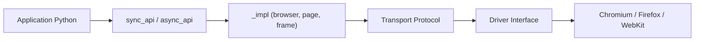

# microsoft/playwright-python

> Binding Python de Playwright pour piloter Chromium, Firefox et WebKit, en API synchrone ou asynchrone.

## Le problème
Tester ou automatiser des pages web de façon fiable sur plusieurs navigateurs sans gérer chaque protocole à la main.

## Ce que ça fait vraiment
Expose une API Playwright en Python : lancer un navigateur, ouvrir une page, naviguer, capturer un écran, simuler la saisie et le réseau. Deux façades (`sync_api`, `async_api`) partagent une même implémentation `_impl`, qui dialogue avec un pilote via un canal de transport ; le pilote contrôle les moteurs de navigateur.

## Comment c'est branché


## Essayer
Le README ne documente pas de commande shell ; il donne seulement cet exemple :
```python
from playwright.sync_api import sync_playwright

with sync_playwright() as p:
    for browser_type in [p.chromium, p.firefox, p.webkit]:
        browser = browser_type.launch()
        page = browser.new_page()
        page.goto('http://playwright.dev')
        page.screenshot(path=f'example-{browser_type.name}.png')
        browser.close()
```

## Coût et pièges
Gratuit. L'installation des navigateurs n'est pas décrite dans le README (voir la documentation en ligne). Les scripts lancent de vrais navigateurs : prévoir CPU et mémoire en CI.

## Ce que ce n'est pas
Ce n'est pas un outil de scraping clé en main ni un service de test hébergé : c'est une bibliothèque de pilotage, à intégrer à ton code ou à ton framework de tests.

## Alternatives
Le README cite les mêmes bibliothèques dans d'autres langages : Node.js, .NET et Java.

## Pour toi
Adopter : référence pour automatiser un navigateur depuis Python (tests d'interfaces de modèles, collecte de pages), portée par Microsoft et suivie de près (16 issues ouvertes).

